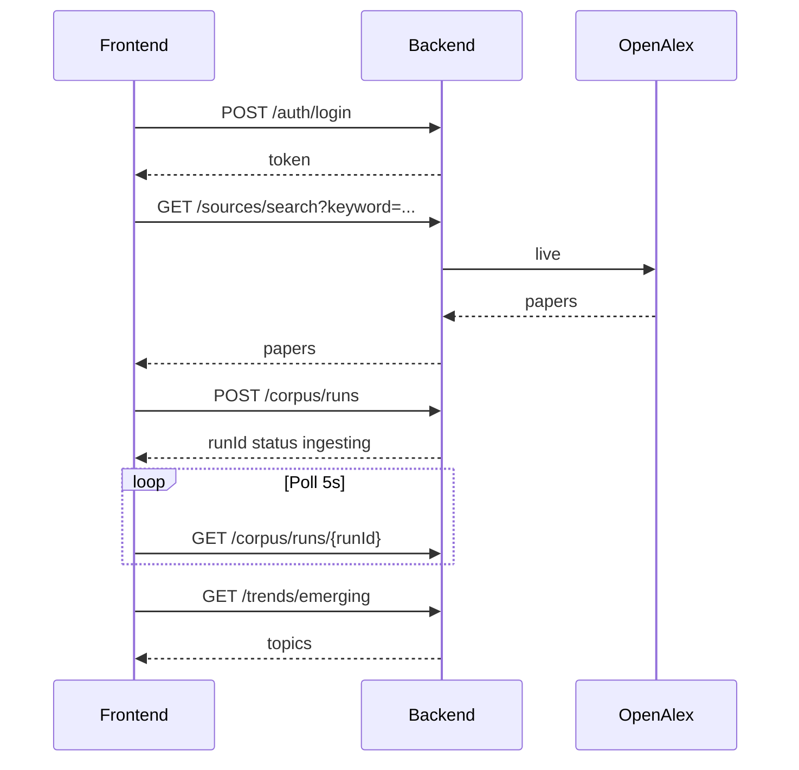

# Hướng dẫn tích hợp & test API cho Frontend

Tài liệu dành cho team FE: URL production, bảng endpoint, curl mẫu, JWT, kết quả smoke test.

| Tài liệu liên quan | Nội dung |
|--------------------|----------|
| [12-luong-nghiep-vu.md](12-luong-nghiep-vu.md) | **Use case & luồng nghiệp vụ (diagram)** |
| [03-api-dac-ta.md](03-api-dac-ta.md) | Đặc tả đầy đủ từng API |
| [04-api-chi-tiet.md](04-api-chi-tiet.md) | Trường request/response chi tiết |
| [ket-qua-test.md](../scripts/ket-qua-test.md) | Kết quả test tự động mới nhất |

---

## 1. Kết nối (Production)

| Mục | URL |
|-----|-----|
| **Base API (FE dùng)** | `https://scientific-journal-publication-trend-tracking-sy-production.up.railway.app/api/v1` |
| Swagger UI | `https://scientific-journal-publication-trend-tracking-sy-production.up.railway.app/api-docs` |
| OpenAPI JSON (codegen) | `https://scientific-journal-publication-trend-tracking-sy-production.up.railway.app/api-docs.json` |
| Health | `https://scientific-journal-publication-trend-tracking-sy-production.up.railway.app/health` |

**Không** gọi trực tiếp AI service (`lavish-adventure-production-dd7f.up.railway.app`) từ FE — chỉ qua `/api/v1/ai/*`.

### Cấu hình FE (Vite / React)

```env
VITE_API_BASE_URL=https://scientific-journal-publication-trend-tracking-sy-production.up.railway.app/api/v1
```

```javascript
import axios from 'axios';

const api = axios.create({
  baseURL: import.meta.env.VITE_API_BASE_URL,
  headers: { 'Content-Type': 'application/json' },
});

api.interceptors.request.use((config) => {
  const token = localStorage.getItem('token');
  if (token) config.headers.Authorization = `Bearer ${token}`;
  return config;
});
```

### UI stack đề xuất

| Nhóm | Công nghệ |
|------|-----------|
| Core | React + Vite |
| Styling | Tailwind CSS |
| Component system | shadcn/ui |
| UI motion | framer-motion |
| Chart | Recharts |
| 3D / interactive graph | three, @react-three/fiber, @react-three/drei, react-force-graph |

### 3D Motion & Interactive Visual Layer

FE dùng 3D có kiểm soát để tăng cảm giác “research intelligence”, nhưng không làm rối dashboard.

**Vị trí dùng 3D**

| Màn hình | 3D/animation nên dùng | Dữ liệu |
|----------|-----------------------|---------|
| `/` Landing | Nền keyword constellation / research network, node là keyword và edge là quan hệ chủ đề | `GET /trends/trending`, fallback mock nhẹ nếu chưa có dữ liệu |
| `/insights` | Keyword graph có chế độ 2D/3D, node màu theo category | `GET /trends/keyword-graph` |
| `/workspaces/:id` | Mini research map thể hiện paper, keyword, note trong workspace | `GET /workspaces/{id}/trends`, `GET /workspaces/{id}/keyword-graph` |
| `/corpus/:id` | Animation pipeline nhẹ cho `pending -> ingesting -> analyzing -> completed` | `GET /corpus/runs/{id}` |

**Nguyên tắc UX**

- Không dùng 3D cho form login/register, bảng paper, bookmark, note editor.
- Dashboard dữ liệu vẫn ưu tiên đọc nhanh, so sánh dễ, không để 3D che nội dung chính.
- Mobile fallback sang 2D hoặc giảm hiệu ứng.
- Tôn trọng `prefers-reduced-motion`.
- Lazy load component 3D để không làm chậm trang chính.
- Canvas 3D cần kích thước ổn định, không làm layout nhảy khi loading.

### Codegen (tùy chọn)

```bash
npx openapi-typescript-codegen \
  --input https://scientific-journal-publication-trend-tracking-sy-production.up.railway.app/api-docs.json \
  --output ./src/api/generated \
  --client axios
```

---

## 2. Bảng endpoint

Prefix: `/api/v1` trừ `/health` và `/api-docs`.

| # | Method | Path | Auth | Smoke | Ghi chú |
|---|--------|------|------|-------|---------|
| 1 | GET | `/health` | Không | PASS | Ngoài `/api/v1` |
| 2 | GET | `/api-docs.json` | Không | PASS | OpenAPI 3 |
| 3 | POST | `/auth/register` | Không | PASS | 201 hoặc 409 |
| 4 | POST | `/auth/login` | Không | PASS | Trả `token` |
| 5 | GET | `/auth/me` | JWT | PASS | |
| 6 | GET | `/sources/search` | Không | PASS | `source`: `openalex`, `semanticscholar`, `crossref`, `ieee`, `exa` |
| 7 | GET | `/sources/trend` | Không | PASS | `keyword`, `startYear` |
| 8 | GET | `/sources/journal` | Không | PASS | `query` |
| 9 | GET | `/sources/author` | Không | PASS | `query` |
| 10 | GET | `/papers/search` | Không | PASS | Tìm paper đã lưu trong MongoDB |
| 11 | GET | `/papers/bookmarks` | JWT | PASS* | *Sau redeploy BE (fix route + fallback) |
| 12 | GET | `/papers/{paperId}` | Không | — | Cần ObjectId Mongo hợp lệ |
| 13 | POST | `/papers` | JWT | PASS | Body bắt buộc `paper.source` |
| 14 | POST | `/papers/{paperId}/bookmark` | JWT | — | |
| 15 | POST | `/papers/{paperId}/pdf` | JWT | — | Upload PDF field `pdf`, multipart |
| 16 | POST | `/corpus/runs` | Không | PASS | 202, poll status |
| 17 | GET | `/corpus/runs` | Không | PASS | |
| 18 | GET | `/corpus/runs/{runId}` | Không | PASS | |
| 19 | GET | `/corpus/runs/{runId}/papers` | Không | PASS | |
| 20 | POST | `/corpus/runs/{runId}/follow` | JWT | PASS | |
| 21 | GET | `/corpus/me/tracked` | JWT | PASS | |
| 22 | GET | `/notifications` | JWT | — | Query: `page`, `limit`, `unreadOnly` |
| 23 | GET | `/notifications/unread-count` | JWT | — | Badge số chưa đọc |
| 24 | PATCH | `/notifications/{id}/read` | JWT | — | |
| 25 | PATCH | `/notifications/read-all` | JWT | — | |
| 26 | GET | `/trends/keyword` | Không | PASS | Live trend |
| 27 | POST | `/trends/compare` | Không | PASS | Body: `keywords[]` |
| 28 | GET | `/trends/emerging` | Không | PASS | Có thể `topics: []` nếu chưa corpus |
| 29 | GET | `/trends/trending` | Không | PASS | |
| 30 | GET | `/trends/keyword-categories` | Không | PASS | Keyword theo `domain/algorithm/application/...` |
| 31 | GET | `/trends/keyword-graph` | Không | PASS | Nodes/edges cho graph |
| 32 | GET | `/trends/algorithm-domains` | Không | PASS | Cặp thuật toán-domain |
| 33 | GET | `/trends/topics/{topicId}` | Không | — | |
| 34 | POST | `/workspaces` | JWT | — | Tạo Research Workspace |
| 35 | GET | `/workspaces` | JWT | — | Danh sách workspace của user |
| 36 | GET | `/workspaces/{workspaceId}` | JWT | — | Chi tiết + stats |
| 37 | POST | `/workspaces/{workspaceId}/members` | JWT | — | Owner thêm member |
| 38 | POST | `/workspaces/{workspaceId}/papers` | JWT | — | Thêm paper vào workspace |
| 39 | GET | `/workspaces/{workspaceId}/papers` | JWT | — | Paper trong workspace |
| 40 | POST | `/workspaces/{workspaceId}/papers/{paperId}/pdf` | JWT | — | Upload PDF trong workspace |
| 41 | POST | `/workspaces/{workspaceId}/corpus/runs` | JWT | — | Corpus trong workspace |
| 42 | GET | `/workspaces/{workspaceId}/trends` | JWT | — | Workspace trend |
| 43 | GET | `/workspaces/{workspaceId}/keyword-graph` | JWT | — | Graph riêng |
| 44 | POST | `/workspaces/{workspaceId}/notes` | JWT | — | Thêm note |
| 45 | GET | `/workspaces/{workspaceId}/notes` | JWT | — | Danh sách note |
| 46 | POST | `/workspaces/{workspaceId}/alerts` | JWT | — | Tạo alert |
| 47 | GET | `/workspaces/{workspaceId}/alerts` | JWT | — | Danh sách alert |
| 48 | GET | `/ai/health` | Không | PASS | Proxy AI |
| 49 | POST | `/ai/embeddings/embed` | Không | PASS | Body: `{ text }` |
| 50 | POST | `/ai/embeddings/embed-batch` | Không | PASS | `{ texts: [] }` |
| 51 | POST | `/ai/embeddings/similarity` | Không | PASS | `{ text1, text2 }` |
| 52 | POST | `/ai/recommendations/papers` | Không | PASS | |
| 53 | POST | `/ai/recommendations/research-directions` | Không | PASS | `{ keywords: [] }` |
| 54 | POST | `/ai/summarization/abstract` | Không | PASS | |
| 55 | POST | `/ai/summarization/extract-problem` | Không | PASS | |

Chi tiết trường: [04-api-chi-tiet.md](04-api-chi-tiet.md).

---

## 3. Luồng tích hợp khuyến nghị



1. Đăng nhập → lưu JWT  
2. Tìm kiếm live: `GET /sources/search`; tìm paper đã lưu/corpus: `GET /papers/search`  
3. Bắt đầu corpus: `POST /corpus/runs` → poll `GET /corpus/runs/{runId}` đến `completed`  
4. Dashboard: `GET /corpus/runs/{id}/papers`, `GET /trends/emerging?analysisRunId=...`  
5. Theo dõi corpus: `POST /corpus/runs/{id}/follow` → nhận thông báo khi `completed` / emerging  
6. Thông báo: `GET /notifications/unread-count`, `GET /notifications`, `PATCH .../read`  
7. AI: `POST /api/v1/ai/...` (không cần JWT hiện tại)

Schema DB: [13-schema-hop-nhat.md](13-schema-hop-nhat.md).

---

## 4. Kịch bản test (curl)

Thay `BASE` nếu cần:

```bash
BASE=https://scientific-journal-publication-trend-tracking-sy-production.up.railway.app
API=$BASE/api/v1
```

### 4.1 Health & OpenAPI

```bash
curl -s $BASE/health
curl -s $BASE/api-docs.json | head -c 200
```

### 4.2 Auth

```bash
curl -s -X POST $API/auth/register \
  -H "Content-Type: application/json" \
  -d '{"name":"Demo User","email":"demo.user@gmail.com","password":"DemoPass123!","role":"student"}'

curl -s -X POST $API/auth/login \
  -H "Content-Type: application/json" \
  -d '{"email":"demo.user@gmail.com","password":"DemoPass123!"}'
# Lưu token:
export TOKEN="<paste_token_here>"

curl -s $API/auth/me -H "Authorization: Bearer $TOKEN"
```

> Email phải hợp lệ (không dùng `@test.local`).

### 4.3 Search live

```bash
curl -s "$API/sources/search?keyword=machine%20learning&limit=5"
curl -s "$API/papers/search?keyword=AI&limit=5"
```

### 4.4 Corpus

```bash
curl -s -X POST $API/corpus/runs \
  -H "Content-Type: application/json" \
  -d '{"seedKeyword":"federated learning","startYear":2022,"endYear":2024,"maxPages":1,"perPage":5}'

export RUN_ID="<run._id from response>"
curl -s $API/corpus/runs/$RUN_ID
curl -s $API/corpus/runs/$RUN_ID/papers
```

### 4.5 Trends

```bash
curl -s "$API/trends/keyword?keyword=machine%20learning&startYear=2020"
curl -s "$API/trends/emerging?limit=10"
curl -s -X POST $API/trends/compare \
  -H "Content-Type: application/json" \
  -d '{"keywords":["AI","blockchain"],"startYear":2020}'
```

### 4.6 AI (qua backend)

```bash
curl -s $API/ai/health

curl -s -X POST $API/ai/embeddings/embed \
  -H "Content-Type: application/json" \
  -d '{"text":"machine learning in healthcare"}'

curl -s -X POST $API/ai/summarization/abstract \
  -H "Content-Type: application/json" \
  -d '{"abstract":"We propose a CNN for medical imaging. Results show 95% accuracy.","maxLength":80}'
```

### 4.7 Papers (JWT) — sau redeploy route fix

```bash
curl -s $API/papers/bookmarks -H "Authorization: Bearer $TOKEN"

curl -s -X POST $API/papers \
  -H "Authorization: Bearer $TOKEN" \
  -H "Content-Type: application/json" \
  -d '{"paper":{"title":"FE Test","abstract":"Test","source":"openalex","publicationYear":2024}}'
```

---

## 5. Lỗi thường gặp

| Mã / triệu chứng | Nguyên nhân | Cách xử lý |
|------------------|-------------|------------|
| CORS | `CORS_ORIGIN` BE chưa có URL FE | Nhờ BE thêm origin Vercel/local vào Railway Variables |
| 401 | Thiếu/sai JWT | Login lại, header `Authorization: Bearer ...` |
| 504 / timeout search | API nguồn ngoài chậm (>90s) | `limit=5`, retry; hiển thị loading |
| 403 / source key rejected | API key sai hoặc chưa active | Kiểm tra biến môi trường và trạng thái key |
| 429 / rate limit | API nguồn ngoài giới hạn request | Chờ rồi retry, giảm `limit` |
| `topics: []` emerging | Chưa corpus hoặc chưa `completed` | Chạy `POST /corpus/runs` + poll |
| AI unavailable | `AI_SERVICE_URL` sai trên BE | BE set `https://lavish-adventure-production-dd7f.up.railway.app` |
| 500 bookmarks | Production chưa deploy bản mới | Redeploy backend (route + fallback trong controller) |
| 400 save paper | Thiếu `paper.source` | Gửi `"source": "openalex"` |

---

## 6. Kết quả smoke test production

Nguồn: [ket-qua-test.md](../scripts/ket-qua-test.md) (2026-05-22).

- **PASS:** 29/30 endpoint (save paper OK với `source`)  
- **FAIL còn lại:** `GET /papers/bookmarks` trên production cũ — redeploy backend  

Chạy lại toàn bộ:

```bash
chmod +x scripts/test-production.sh
./scripts/test-production.sh scripts/ket-qua-test.md
```

---

## 7. Checklist FE trước khi release

- [ ] `VITE_API_BASE_URL` trỏ production `/api/v1`
- [ ] Login + JWT trên mọi route protected
- [ ] Search có loading (API ngoài 1–90s)
- [ ] Corpus: UI poll `status` đến `completed` / `failed`
- [ ] Không hardcode `localhost` trong build production
- [ ] Xử lý `success: false` và `message` từ API
