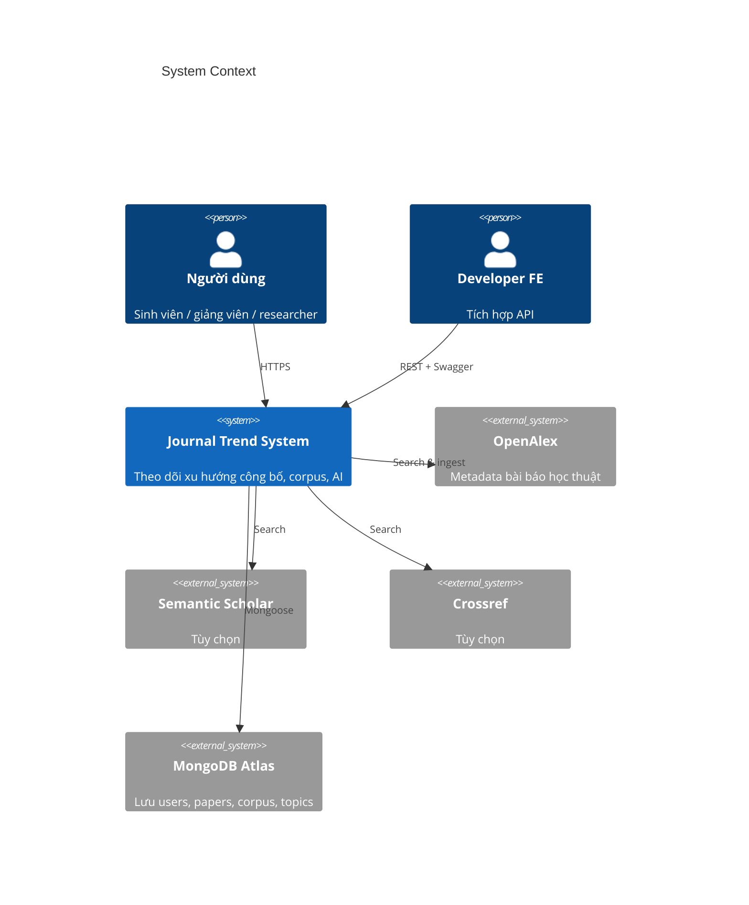
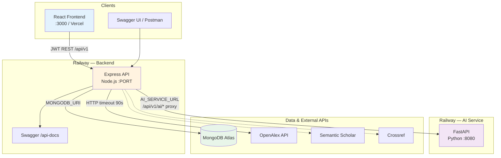
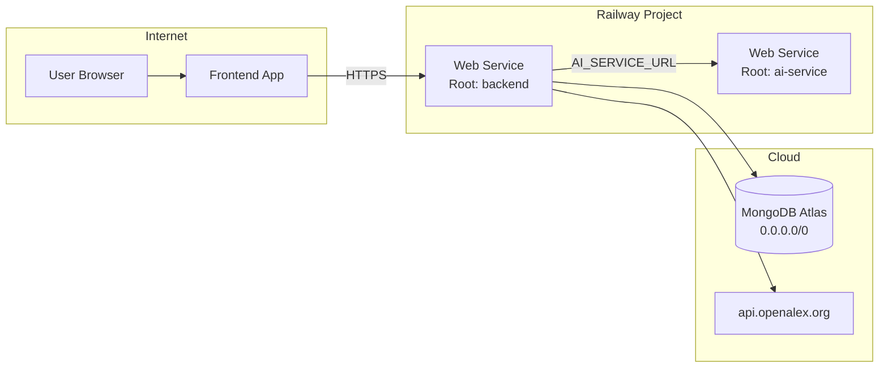
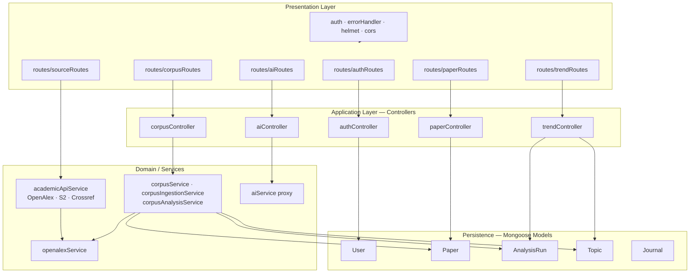
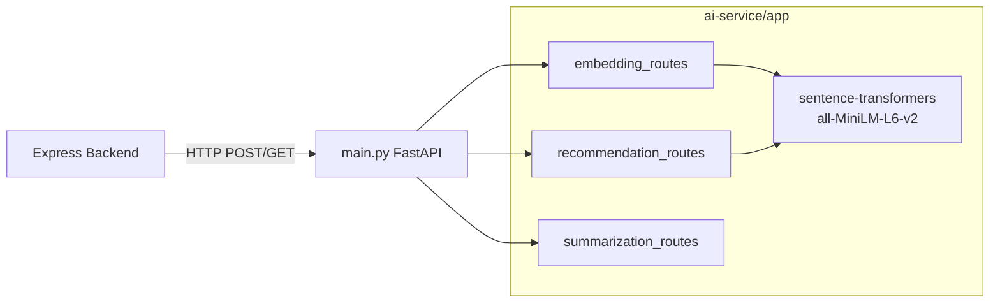
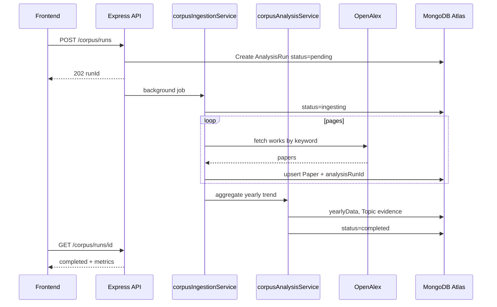
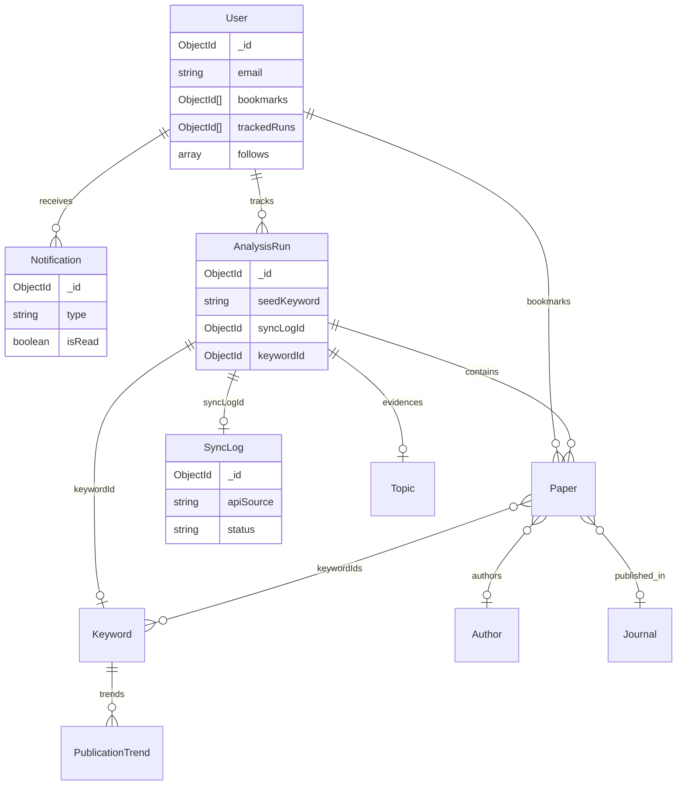
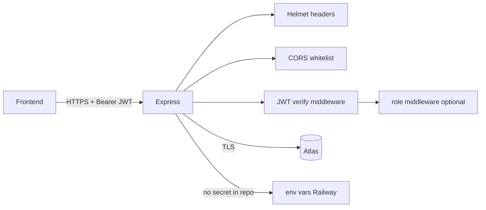

# Software Architecture Diagram

**Hệ thống theo dõi xu hướng công bố tạp chí khoa học** — FPT Capstone

| | |
|---|---|
| Kiến trúc | Monorepo, **2 microservice** (Node + Python), MongoDB Atlas |
| Deploy | Railway (Backend + AI), FE tách repo / Vercel |
| API | REST `/api/v1`, Swagger `/api-docs` |

Tài liệu liên quan: [12-luong-nghiep-vu.md](12-luong-nghiep-vu.md) · [03-api-dac-ta.md](03-api-dac-ta.md) · [02-deploy-railway.md](02-deploy-railway.md)

---

## 1. System Context (C4 — Level 1)

Ai dùng hệ thống và hệ thống nói chuyện với ai bên ngoài.



---

## 2. Container Diagram (C4 — Level 2)

Các **container** (ứng dụng deploy được) và luồng giao tiếp.



**Quy tắc quan trọng**

- FE **không** gọi trực tiếp container AI — chỉ qua BE.
- OpenAlex dùng cho **live search** và **corpus ingestion** (background).

---

## 3. Deployment Architecture (Production)



| Container | URL production (team) |
|-----------|------------------------|
| Backend | `scientific-journal-publication-trend-tracking-sy-production.up.railway.app` |
| AI | `lavish-adventure-production-dd7f.up.railway.app` (nội bộ BE) |
| Atlas | Connection string `MONGODB_URI` |

---

## 4. Backend Component Diagram (Layered)

Cấu trúc **Express MVC** trong `backend/src/`.



---

## 5. AI Service Component



---

## 6. Data Flow — Corpus Pipeline

Luồng dữ liệu khi user bắt đầu theo dõi từ khóa.



---

## 7. Technology Stack

| Layer | Technology |
|-------|------------|
| Frontend | React 18, Tailwind, Axios, Recharts *(phase 2)* |
| API Gateway | Express.js 4, Node 18+ |
| Auth | JWT (HS256), bcryptjs |
| ORM | Mongoose 8 |
| API Docs | swagger-jsdoc, swagger-ui-express |
| AI Runtime | Python 3.9+, FastAPI, uvicorn |
| ML/NLP | sentence-transformers, scikit-learn *(BERTopic roadmap)* |
| Database | MongoDB Atlas |
| External | OpenAlex (primary), Semantic Scholar, Crossref |
| Deploy | Railway Nixpacks/Docker, Docker Compose *(local)* |

---

## 8. Database — Logical Model (ER simplified)



---

## 9. Security Architecture



| Thành phần | Cơ chế |
|------------|--------|
| Transport | HTTPS (Railway) |
| API Auth | `Authorization: Bearer` |
| Password | bcrypt hash, không trả về client |
| Secrets | `JWT_SECRET`, `MONGODB_URI` trên Railway |
| AI | Không public — chỉ BE gọi |

---

## 10. Monorepo Layout

```
Scientific_Journal_Trend_Backend/
├── backend/                 # Container: Express API
│   └── src/
│       ├── routes/          # HTTP endpoints
│       ├── controllers/     # Request handlers
│       ├── services/        # Business + external APIs
│       ├── models/          # Mongoose schemas
│       ├── middlewares/
│       ├── config/
│       └── server.js
├── ai-service/              # Container: FastAPI
│   ├── main.py
│   └── app/routes/
├── docs/                    # Tài liệu + diagram
├── config/                  # Env templates
├── scripts/                 # Smoke test
└── frontend/                # (phase 2)
```

---

*Cập nhật: 05/2026 — Backend + Corpus + AI proxy trên Railway*
