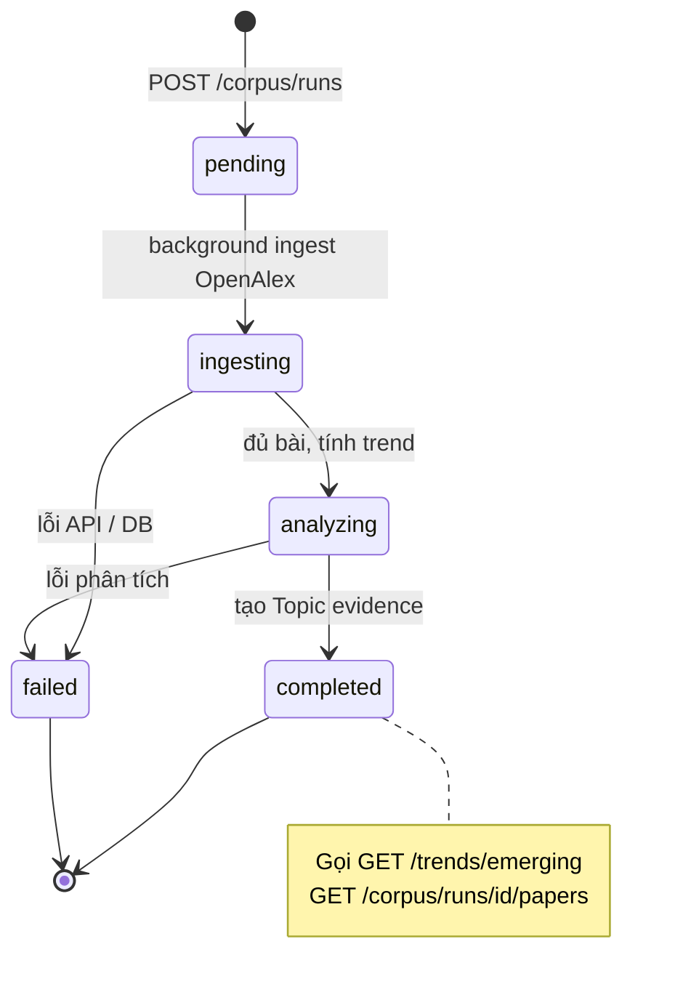
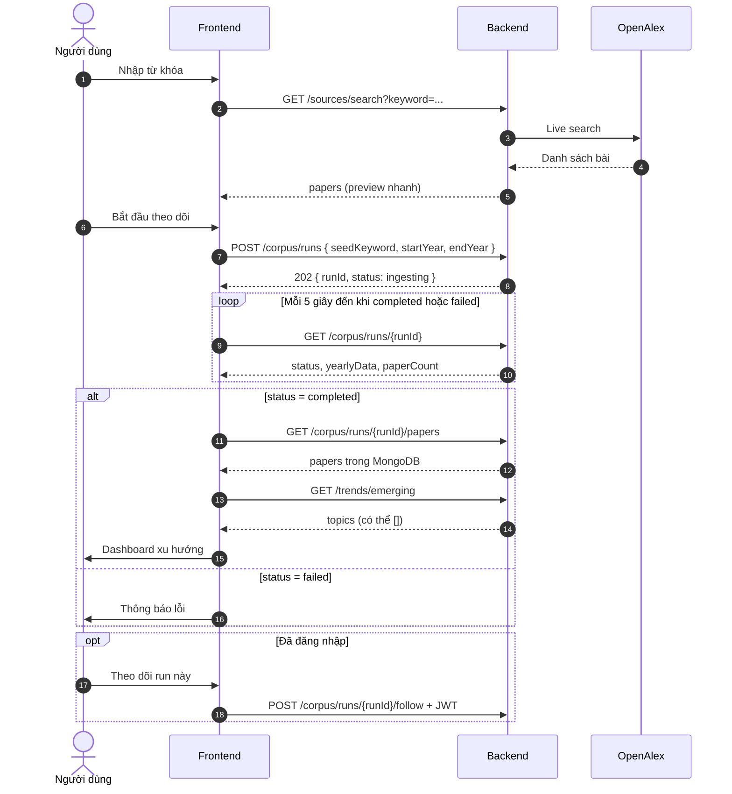
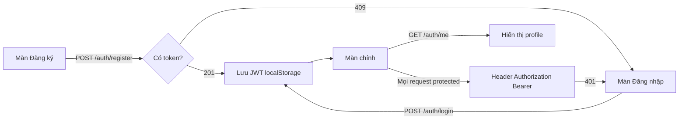
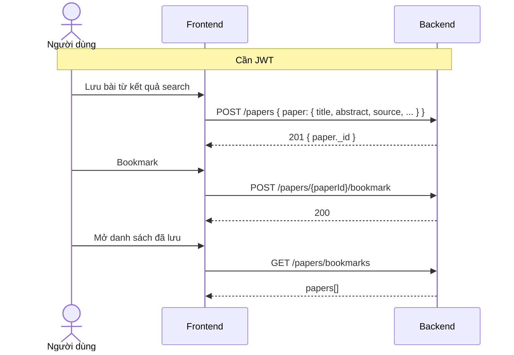
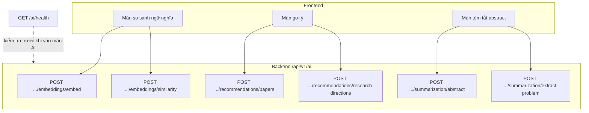
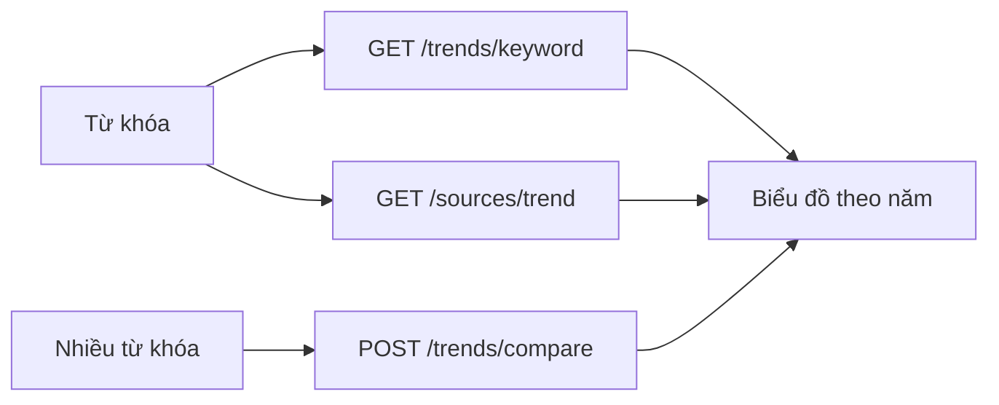

# Luồng nghiệp vụ & Use Case (cho Frontend)

Tài liệu mô tả **ai làm gì**, **luồng màn hình gọi API nào**, trạng thái corpus — bổ sung cho [05-huong-dan-fe.md](05-huong-dan-fe.md) (kỹ thuật) và [03-api-dac-ta.md](03-api-dac-ta.md) (đặc tả API).

---

## 1. Actor (tác nhân)

| Actor | Mô tả |
|-------|--------|
| **Khách** | Chưa đăng nhập — dùng search live, corpus, trend, AI (không bookmark/follow) |
| **Người dùng** | Đã đăng nhập (student / researcher / lecturer / admin) — thêm bookmark, lưu bài, follow corpus |
| **Hệ thống BE** | Express + MongoDB Atlas |
| **OpenAlex** | API học thuật (search, ingest corpus) |
| **AI Service** | FastAPI — FE **chỉ** gọi qua BE `/api/v1/ai/*` |

---

## 2. Sơ đồ Use Case

```mermaid
flowchart TB
  subgraph actors [Tác nhân]
    Guest((Khách))
    User((Người dùng đăng nhập))
  end

  subgraph auth [Xác thực]
    UC1[Đăng ký]
    UC2[Đăng nhập]
    UC3[Xem hồ sơ]
  end

  subgraph explore [Khám phá - không bắt buộc JWT]
    UC4[Tìm bài báo live]
    UC5[Xem trend từ khóa live]
    UC6[So sánh từ khóa]
    UC7[Tìm tạp chí / tác giả]
  end

  subgraph corpus [Corpus hybrid]
    UC8[Bắt đầu theo dõi từ khóa]
    UC9[Theo dõi tiến độ run]
    UC10[Xem bài trong corpus]
    UC11[Xem chủ đề emerging / trending]
  end

  subgraph personal [Cá nhân - JWT]
    UC12[Lưu bài vào DB]
    UC13[Bookmark bài]
    UC14[Danh sách bookmark]
    UC15[Follow corpus run]
    UC16[Corpus đang theo dõi]
  end

  subgraph ai [AI qua BE]
    UC17[Embedding / tương đồng]
    UC18[Gợi ý bài / hướng nghiên cứu]
    UC19[Tóm tắt / trích vấn đề]
  end

  Guest --> UC4
  Guest --> UC5
  Guest --> UC6
  Guest --> UC7
  Guest --> UC8
  Guest --> UC9
  Guest --> UC10
  Guest --> UC11
  Guest --> UC17
  Guest --> UC18
  Guest --> UC19

  User --> UC1
  User --> UC2
  User --> UC3
  User --> UC4
  User --> UC5
  User --> UC6
  User --> UC7
  User --> UC8
  User --> UC9
  User --> UC10
  User --> UC11
  User --> UC12
  User --> UC13
  User --> UC14
  User --> UC15
  User --> UC16
  User --> UC17
  User --> UC18
  User --> UC19
```

---

## 3. Trạng thái Corpus (`AnalysisRun`)

FE cần poll `GET /corpus/runs/{runId}` và hiển thị UI theo `status`:

| status | Ý nghĩa UI | Hành động FE |
|--------|------------|--------------|
| `pending` | Đang khởi tạo | Spinner, poll 3–5s |
| `ingesting` | Đang tải bài từ OpenAlex | Progress + poll |
| `analyzing` | Đang tính trend / topic | Poll |
| `completed` | Xong | Hiện chart, papers, emerging |
| `failed` | Lỗi | Thông báo + nút thử lại (tạo run mới) |

---

## 4. Luồng chính: Khám phá → Corpus → Dashboard

Luồng **khuyến nghị** (hybrid) — phù hợp capstone “theo dõi xu hướng có kiểm chứng”.

**API theo bước**

| Bước | API | Auth |
|------|-----|------|
| 1. Tìm nhanh | `GET /sources/search` | Không |
| 2. Tạo corpus | `POST /corpus/runs` | Không |
| 3. Poll | `GET /corpus/runs/{id}` | Không |
| 4. Danh sách bài | `GET /corpus/runs/{id}/papers` | Không |
| 5. Chủ đề mới | `GET /trends/emerging` | Không |
| 6. Follow | `POST /corpus/runs/{id}/follow` | JWT |

---

## 5. Luồng đăng nhập & phiên

| Màn hình | API | Ghi chú |
|----------|-----|---------|
| Đăng ký | `POST /auth/register` | Email hợp lệ (vd `@gmail.com`) |
| Đăng nhập | `POST /auth/login` | Trả `token` |
| Header app | `GET /auth/me` | Kiểm tra phiên khi mở app |

---

## 6. Luồng lưu & bookmark bài báo

**Quy tắc nghiệp vụ**

- `POST /papers`: bắt buộc `paper.source` = `openalex` | `semantic_scholar` | `crossref`
- Bookmark cần `paperId` là ObjectId Mongo (bài đã lưu hoặc có sẵn trong DB)
- `GET /papers/bookmarks` chỉ khi đã login

---

## 7. Luồng AI (luôn qua Backend)

| Chức năng UI | API | Timeout gợi ý UI |
|--------------|-----|------------------|
| Kiểm tra AI sẵn sàng | `GET /ai/health` | 5s |
| Gợi ý bài | `POST /ai/recommendations/papers` | 30–120s |
| Hướng nghiên cứu | `POST /ai/recommendations/research-directions` | 30s |
| Tóm tắt | `POST /ai/summarization/abstract` | 30s |
| Embedding | `POST /ai/embeddings/embed` | 30–90s |

---

## 8. Luồng phụ: Trend live (không cần corpus)

Dùng khi chỉ cần xem nhanh, **không** lưu snapshot.

Lưu ý: OpenAlex có thể chậm → BE trả **504**; FE hiển thị loading / retry.

---

## 9. Ánh xạ màn hình gợi ý ↔ API

| Màn hình (gợi ý) | API chính | JWT |
|------------------|-----------|-----|
| Landing / Tìm kiếm | `GET /sources/search`, `GET /papers/search` | Không |
| Chi tiết bài (live) | Dữ liệu từ search; lưu thì `POST /papers` | Lưu: Có |
| Theo dõi xu hướng | `POST /corpus/runs` + poll + papers + emerging | Follow: Có |
| So sánh keyword | `POST /trends/compare` | Không |
| Trending / Emerging | `GET /trends/trending`, `GET /trends/emerging` | Không |
| Đăng nhập / Đăng ký | `POST /auth/login`, `register` | — |
| Thư viện / Bookmark | `GET /papers/bookmarks` | Có |
| Gợi ý AI | `/ai/recommendations/*` | Không* |
| Tóm tắt AI | `/ai/summarization/*` | Không* |

\*Hiện tại AI không bắt JWT; có thể thêm sau.

---

## 10. Lỗi nghiệp vụ FE cần xử lý

| Tình huống | HTTP / dữ liệu | UI gợi ý |
|------------|----------------|----------|
| Chưa corpus xong | `emerging` → `topics: []` | “Hoàn tất theo dõi từ khóa trước” |
| OpenAlex chậm | 504 | Loading + thử lại |
| Chưa login bookmark | 401 | Chuyển màn đăng nhập |
| Corpus lỗi | `status: failed` | Hiện `errorMessage` nếu có |
| AI down | `/ai/health` unavailable | Ẩn hoặc disable tính năng AI |

---

## Tài liệu liên quan

- Kiến trúc phần mềm: [06-kien-truc.md](06-kien-truc.md)
- Kỹ thuật FE: [05-huong-dan-fe.md](05-huong-dan-fe.md)
- Đặc tả API: [03-api-dac-ta.md](03-api-dac-ta.md)
- Request/response: [04-api-chi-tiet.md](04-api-chi-tiet.md)
