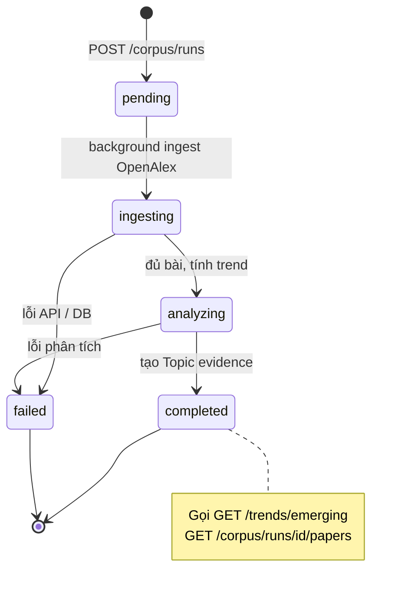
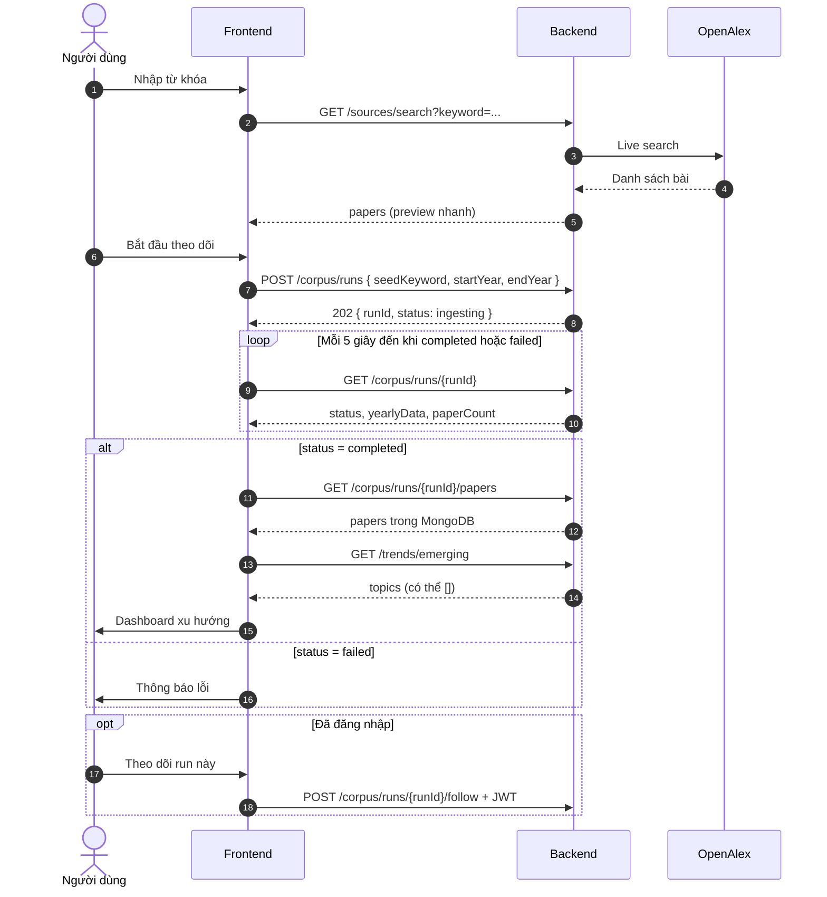
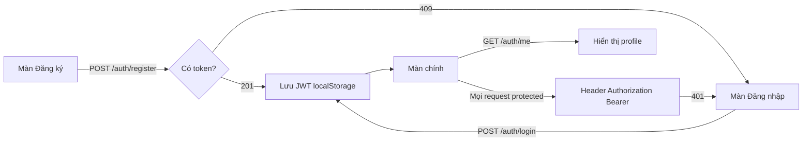
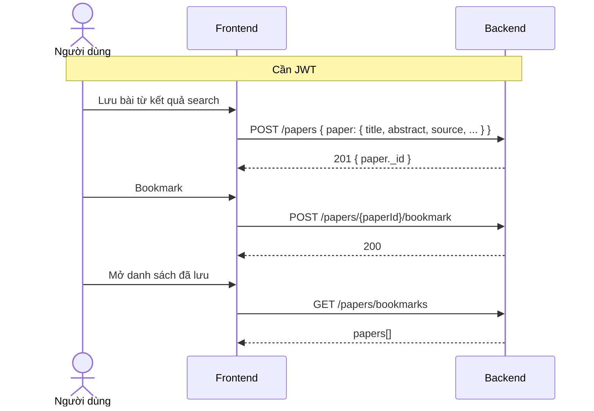
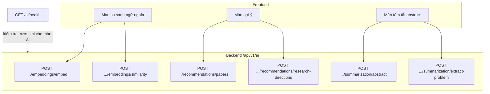
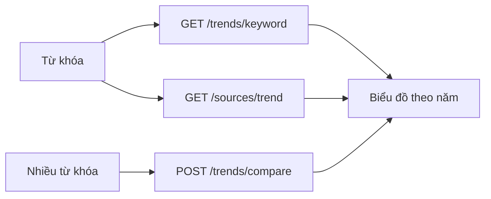
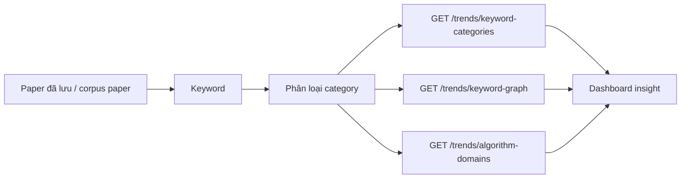
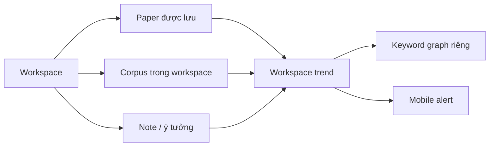

# Luồng nghiệp vụ & Use Case (cho Frontend)

Tài liệu mô tả **ai làm gì**, **luồng màn hình gọi API nào**, trạng thái corpus — bổ sung cho [05-huong-dan-fe.md](05-huong-dan-fe.md) (kỹ thuật) và [03-api-dac-ta.md](03-api-dac-ta.md) (đặc tả API).

---

## 1. Actor (tác nhân)

| Actor | Mô tả |
|-------|--------|
| **Khách** | Chưa đăng nhập — dùng search live, corpus, trend, AI (không bookmark/follow) |
| **Người dùng** | Đã đăng nhập (student / researcher / lecturer / admin) — thêm bookmark, lưu bài, follow corpus |
| **Nhóm nghiên cứu / Lab** | Nhiều người dùng cùng làm trong một Research Workspace |
| **Hệ thống BE** | Express + MongoDB Atlas |
| **OpenAlex** | API học thuật (search, ingest corpus) |
| **AI Service** | FastAPI — FE **chỉ** gọi qua BE `/api/v1/ai/*` |

---

## 2. Giải thích use case theo nghiệp vụ

**Use case** là cách mô tả: **ai dùng hệ thống**, họ **muốn làm gì**, và hệ thống **xử lý qua luồng/API nào**.

Trong dự án này, use case quan trọng nhất không phải chỉ là “tìm bài báo”. Hệ thống hướng tới việc giúp sinh viên, giảng viên và nhà nghiên cứu biết được **chủ đề nghiên cứu nào đang tăng trưởng**, **thuật toán nào đang nổi**, và **thuật toán đó đang xuất hiện trong domain nào**.

Câu mô tả ngắn để thuyết trình:

> Người dùng nhập một keyword, hệ thống lấy paper từ các nguồn học thuật, tạo corpus, phân tích số lượng công bố theo thời gian, phân loại keyword thành domain/algorithm/application/method, rồi hiển thị dashboard xu hướng và graph quan hệ chủ đề.

### 2.1 Bảng use case chính

| Use case | Actor | API chính | Ý nghĩa nghiệp vụ |
|---|---|---|---|
| Tìm paper live | Khách / Người dùng | `GET /sources/search` | Khám phá nhanh paper từ OpenAlex, Semantic Scholar, Crossref, IEEE, Exa |
| Tạo corpus | Khách / Người dùng | `POST /corpus/runs` | Lưu snapshot paper theo keyword để phân tích có bằng chứng |
| Poll corpus | Khách / Người dùng | `GET /corpus/runs/{id}` | Theo dõi trạng thái ingest/analyze cho tới khi hoàn tất |
| Xem paper trong corpus | Khách / Người dùng | `GET /corpus/runs/{id}/papers` | Xem các bài đã được hệ thống thu thập và lưu vào MongoDB |
| Xem trend | Khách / Người dùng | `/trends/*` | Xem chủ đề nổi, tốc độ tăng trưởng, keyword graph |
| Phân loại keyword | Hệ thống BE | `keywordClassificationService` | Hiểu keyword là domain, algorithm, application, method, dataset, tool hay general |
| Graph keyword/topic | Khách / Người dùng | `GET /trends/keyword-graph` | Nhìn mối liên hệ giữa các keyword qua đồng xuất hiện trong paper |
| Thuật toán theo domain | Khách / Người dùng | `GET /trends/algorithm-domains` | Biết thuật toán nào đang được dùng trong lĩnh vực nào |
| Lưu bài / bookmark | Người dùng đăng nhập | `POST /papers`, `/papers/*/bookmark` | Cá nhân hóa danh sách paper quan tâm |
| Follow corpus | Người dùng đăng nhập | `POST /corpus/runs/{id}/follow` | Theo dõi một chủ đề/corpus run để nhận thông báo |
| AI support | Khách / Người dùng | `/ai/*` | Tóm tắt abstract, gợi ý bài, gợi ý hướng nghiên cứu, similarity |
| Tạo research workspace | Người dùng đăng nhập | `POST /workspaces` | Tạo không gian nghiên cứu riêng cho cá nhân hoặc nhóm |
| Workspace trend | Người dùng / Nhóm | `/workspaces/{id}/trends` | Xem xu hướng nội bộ dựa trên paper/corpus/note trong workspace |
| Mobile alert | Người dùng / Nhóm | `/workspaces/{id}/alerts` | Nhận cảnh báo paper mới hoặc keyword tăng trong workspace |

### 2.2 Luồng hiểu đơn giản theo góc nhìn người dùng

1. **Khám phá nhanh:** người dùng nhập keyword và xem paper live từ các nguồn học thuật.
2. **Theo dõi sâu:** người dùng tạo corpus run để hệ thống lưu snapshot paper theo keyword.
3. **Phân tích:** backend đếm paper theo năm, tính growth rate, emerging score và trend status.
4. **Hiểu vai trò keyword:** hệ thống phân loại keyword thành `domain`, `algorithm`, `application`, `method`, `dataset`, `tool`, `general`.
5. **Trực quan hóa:** dashboard dùng trend, keyword graph và algorithm-domain pairs để biểu diễn dòng chảy nghiên cứu.
6. **Cá nhân hóa:** người dùng đăng nhập để lưu paper, bookmark, follow corpus và dùng AI hỗ trợ đọc hiểu.
7. **Workspace riêng:** cá nhân hoặc nhóm tạo Research Workspace để gom paper, note, corpus và sinh trend nội bộ.

### 2.3 Điểm khác biệt so với công cụ tìm kiếm paper thường

| Công cụ tìm paper thường | Hệ thống của dự án |
|---|---|
| Trả danh sách paper theo keyword | Trả paper và phân tích xu hướng theo thời gian |
| Chủ yếu tìm kiếm live | Có corpus snapshot lưu vào MongoDB để kiểm chứng |
| Không hiểu vai trò keyword | Phân loại keyword thành domain/algorithm/application/method |
| Ít thể hiện quan hệ chủ đề | Có keyword graph và algorithm-domain pairs |
| Người dùng tự đọc abstract | Có AI tóm tắt, similarity, gợi ý bài/hướng nghiên cứu |
| Dữ liệu rời rạc theo từng lần tìm | Có Research Workspace để gom paper/corpus/note và tạo trend riêng |

---

## 3. Sơ đồ Use Case

```mermaid
flowchart TB
  subgraph actors [Tác nhân]
    Guest((Khách))
    User((Người dùng đăng nhập))
  end

  subgraph auth [Xác thực]
    UC1[Đăng ký]
    UC2[Đăng nhập]
    UC3[Xem hồ sơ]
  end

  subgraph explore [Khám phá - không bắt buộc JWT]
    UC4[Tìm bài báo live]
    UC5[Xem trend từ khóa live]
    UC6[So sánh từ khóa]
    UC7[Tìm tạp chí / tác giả]
  end

  subgraph corpus [Corpus hybrid]
    UC8[Bắt đầu theo dõi từ khóa]
    UC9[Theo dõi tiến độ run]
    UC10[Xem bài trong corpus]
    UC11[Xem chủ đề emerging / trending]
  end

  subgraph personal [Cá nhân - JWT]
    UC12[Lưu bài vào DB]
    UC13[Bookmark bài]
    UC14[Danh sách bookmark]
    UC15[Follow corpus run]
    UC16[Corpus đang theo dõi]
  end

  subgraph ai [AI qua BE]
    UC17[Embedding / tương đồng]
    UC18[Gợi ý bài / hướng nghiên cứu]
    UC19[Tóm tắt / trích vấn đề]
  end

  subgraph insight [Insight xu hướng]
    UC20[Phân loại keyword]
    UC21[Xem keyword graph]
    UC22[Xem thuật toán theo domain]
  end

  subgraph workspace [Research Workspace - phase mở rộng]
    UC23[Tạo workspace nghiên cứu]
    UC24[Mời thành viên]
    UC25[Thêm paper vào workspace]
    UC26[Tạo corpus trong workspace]
    UC27[Xem trend riêng của workspace]
    UC28[Ghi note / ý tưởng]
    UC29[Nhận mobile alert]
  end

  Guest --> UC4
  Guest --> UC5
  Guest --> UC6
  Guest --> UC7
  Guest --> UC8
  Guest --> UC9
  Guest --> UC10
  Guest --> UC11
  Guest --> UC17
  Guest --> UC18
  Guest --> UC19
  Guest --> UC20
  Guest --> UC21
  Guest --> UC22

  User --> UC1
  User --> UC2
  User --> UC3
  User --> UC4
  User --> UC5
  User --> UC6
  User --> UC7
  User --> UC8
  User --> UC9
  User --> UC10
  User --> UC11
  User --> UC12
  User --> UC13
  User --> UC14
  User --> UC15
  User --> UC16
  User --> UC17
  User --> UC18
  User --> UC19
  User --> UC20
  User --> UC21
  User --> UC22
  User --> UC23
  User --> UC24
  User --> UC25
  User --> UC26
  User --> UC27
  User --> UC28
  User --> UC29
```

---

## 4. Trạng thái Corpus (`AnalysisRun`)

FE cần poll `GET /corpus/runs/{runId}` và hiển thị UI theo `status`:

| status | Ý nghĩa UI | Hành động FE |
|--------|------------|--------------|
| `pending` | Đang khởi tạo | Spinner, poll 3–5s |
| `ingesting` | Đang tải bài từ OpenAlex | Progress + poll |
| `analyzing` | Đang tính trend / topic | Poll |
| `completed` | Xong | Hiện chart, papers, emerging |
| `failed` | Lỗi | Thông báo + nút thử lại (tạo run mới) |

---

## 5. Luồng chính: Khám phá → Corpus → Dashboard

Luồng **khuyến nghị** (hybrid) — phù hợp capstone “theo dõi xu hướng có kiểm chứng”.

**API theo bước**

| Bước | API | Auth |
|------|-----|------|
| 1. Tìm nhanh | `GET /sources/search` | Không |
| 2. Tạo corpus | `POST /corpus/runs` | Không |
| 3. Poll | `GET /corpus/runs/{id}` | Không |
| 4. Danh sách bài | `GET /corpus/runs/{id}/papers` | Không |
| 5. Chủ đề mới | `GET /trends/emerging` | Không |
| 6. Follow | `POST /corpus/runs/{id}/follow` | JWT |

---

## 6. Luồng đăng nhập & phiên

| Màn hình | API | Ghi chú |
|----------|-----|---------|
| Đăng ký | `POST /auth/register` | Email hợp lệ (vd `@gmail.com`) |
| Đăng nhập | `POST /auth/login` | Trả `token` |
| Header app | `GET /auth/me` | Kiểm tra phiên khi mở app |

---

## 7. Luồng lưu & bookmark bài báo

**Quy tắc nghiệp vụ**

- `POST /papers`: bắt buộc `paper.source` = `openalex` | `semantic_scholar` | `crossref` | `ieee` | `exa`
- Bookmark cần `paperId` là ObjectId Mongo (bài đã lưu hoặc có sẵn trong DB)
- `GET /papers/bookmarks` chỉ khi đã login

---

## 8. Luồng AI (luôn qua Backend)

| Chức năng UI | API | Timeout gợi ý UI |
|--------------|-----|------------------|
| Kiểm tra AI sẵn sàng | `GET /ai/health` | 5s |
| Gợi ý bài | `POST /ai/recommendations/papers` | 30–120s |
| Hướng nghiên cứu | `POST /ai/recommendations/research-directions` | 30s |
| Tóm tắt | `POST /ai/summarization/abstract` | 30s |
| Embedding | `POST /ai/embeddings/embed` | 30–90s |

---

## 9. Luồng phụ: Trend live (không cần corpus)

Dùng khi chỉ cần xem nhanh, **không** lưu snapshot.

Lưu ý: API học thuật bên ngoài có thể chậm hoặc rate-limit → BE trả **403/429/504**; FE hiển thị loading / retry.

---

## 10. Luồng insight: phân loại keyword và graph

Luồng này phục vụ dashboard phân tích sâu. Nó trả lời các câu hỏi mà giảng viên hay quan tâm:

- Keyword nào là **thuật toán**?
- Keyword nào là **domain/lĩnh vực ứng dụng**?
- Thuật toán nào đang xuất hiện cùng domain nào?
- Các keyword/chủ đề liên hệ với nhau như thế nào?

| Câu hỏi nghiệp vụ | API | FE hiển thị |
|-------------------|-----|-------------|
| Keyword nào thuộc domain/algorithm/application? | `GET /trends/keyword-categories` | Bảng hoặc filter theo category |
| Các keyword liên quan nhau thế nào? | `GET /trends/keyword-graph` | Graph node/edge |
| Thuật toán nào nổi trong domain nào? | `GET /trends/algorithm-domains` | Heatmap, bảng pair hoặc graph hai lớp |

---

## 11. Ánh xạ màn hình gợi ý ↔ API

| Màn hình (gợi ý) | API chính | JWT |
|------------------|-----------|-----|
| Landing / Tìm kiếm | `GET /sources/search`, `GET /papers/search` | Không |
| Chi tiết bài (live) | Dữ liệu từ search; lưu thì `POST /papers` | Lưu: Có |
| Theo dõi xu hướng | `POST /corpus/runs` + poll + papers + emerging | Follow: Có |
| Insight keyword/category | `GET /trends/keyword-categories`, `keyword-graph`, `algorithm-domains` | Không |
| So sánh keyword | `POST /trends/compare` | Không |
| Trending / Emerging | `GET /trends/trending`, `GET /trends/emerging` | Không |
| Đăng nhập / Đăng ký | `POST /auth/login`, `register` | — |
| Thư viện / Bookmark | `GET /papers/bookmarks` | Có |
| Gợi ý AI | `/ai/recommendations/*` | Không* |
| Tóm tắt AI | `/ai/summarization/*` | Không* |
| Research Workspace | `/workspaces/*` | Có |
| Workspace Dashboard | `/workspaces/{id}/trends`, `/workspaces/{id}/keyword-graph` | Có |
| Mobile Alert | `/workspaces/{id}/alerts` | Có |

\*Hiện tại AI không bắt JWT; có thể thêm sau.

---

## 12. Phase mở rộng: Research Workspace / Place

Research Workspace là hướng phát triển để dự án có giá trị sản phẩm và tính phí rõ hơn. Nếu phần hiện tại trả lời “thế giới đang nghiên cứu gì?”, Workspace trả lời thêm “nhóm/cá nhân của tôi đang nghiên cứu gì và nên đi tiếp hướng nào?”. Backend v1 đã có API workspace, member, paper, note, corpus, trend, keyword graph và alert.

| Thành phần | Ý nghĩa |
|------------|---------|
| Workspace | Không gian nghiên cứu cá nhân hoặc nhóm |
| Workspace paper | Paper được gom vào thư viện riêng |
| Workspace corpus | Corpus run gắn với workspace |
| Workspace note | Ghi chú, ý tưởng, vấn đề còn mở |
| Workspace trend | Trend tính trên dữ liệu của workspace |
| Mobile alert | Cảnh báo paper mới, keyword mới hoặc trend tăng |

Tài liệu chi tiết: [15-research-workspace.md](15-research-workspace.md)

---

## 13. Lỗi nghiệp vụ FE cần xử lý

| Tình huống | HTTP / dữ liệu | UI gợi ý |
|------------|----------------|----------|
| Chưa corpus xong | `emerging` → `topics: []` | “Hoàn tất theo dõi từ khóa trước” |
| API nguồn ngoài chậm | 504 | Loading + thử lại |
| API key nguồn ngoài chưa active | 403 | Hiện thông báo kiểm tra key |
| API nguồn ngoài rate-limit | 429 | Chờ rồi retry, giảm `limit` |
| Chưa login bookmark | 401 | Chuyển màn đăng nhập |
| Corpus lỗi | `status: failed` | Hiện `errorMessage` nếu có |
| AI down | `/ai/health` unavailable | Ẩn hoặc disable tính năng AI |

---

## Tài liệu liên quan

- Kiến trúc phần mềm: [06-kien-truc.md](06-kien-truc.md)
- Kỹ thuật FE: [05-huong-dan-fe.md](05-huong-dan-fe.md)
- Đặc tả API: [03-api-dac-ta.md](03-api-dac-ta.md)
- Request/response: [04-api-chi-tiet.md](04-api-chi-tiet.md)
- Research Workspace: [15-research-workspace.md](15-research-workspace.md)
