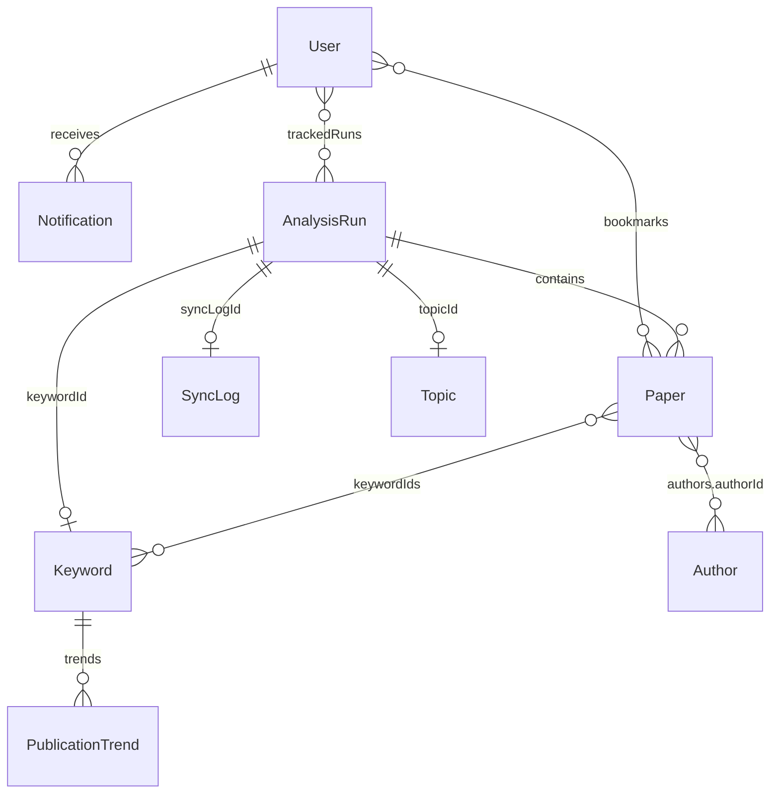

# Schema hợp nhất (FA + WDP301)

Chuẩn đặt tên: **camelCase**, `password` (không `passwordHash`), `timestamps: true`, role lowercase.

Giữ luồng FA: **AnalysisRun**, **Topic**, `/api/v1/corpus/*`. Bổ sung collection WDP với tên FA.

---

## 1. User

| Trường | Kiểu | Ghi chú |
|--------|------|---------|
| name, email, password | String | email unique, password select:false |
| role | enum | researcher, student, lecturer, admin |
| institution, bio, interests, avatar | | |
| isActive, emailVerified | Boolean | |
| lastLogin | Date | cập nhật khi login |
| bookmarks | ObjectId[] → Paper | |
| trackedRuns | subdoc | analysisRunId, notifyEnabled, followedAt |
| follows | subdoc | targetType: keyword \| journal \| analysisRun, targetId, notifyEnabled |

---

## 2. Paper

| Trường | Kiểu | Ghi chú |
|--------|------|---------|
| title, abstract, doi, url | | |
| publicationYear, publicationMonth | Number | WDP month |
| publishedDate, citationCount | | |
| externalIds | { openalex, semanticScholar, crossref } | |
| authors | subdoc | authorId, name, affiliations, externalId, order |
| journalId, journalName | | |
| keywords | String[] | text từ nguồn |
| keywordIds | ObjectId[] → Keyword | sau ingest |
| topics, source, analysisRunId | | FA corpus |
| openAccessUrl, lastSyncedAt | | |

---

## 3. Author (mới)

| Trường | Kiểu |
|--------|------|
| fullName | String required |
| externalAuthorId, affiliation, orcid | String |
| openalexId | String unique sparse |
| worksCount | Number |

---

## 4. Journal

| Trường | Kiểu | Ghi chú |
|--------|------|---------|
| name, issn, publisher | | FA |
| impactFactor, hIndex, paperCount | | |
| fieldDomain | String | WDP |
| isTracked | Boolean | WDP |
| source | openalex, crossref, semantic_scholar | |
| externalIds, lastSyncedAt | | |

---

## 5. Keyword

| Trường | Kiểu | Ghi chú |
|--------|------|---------|
| name, normalizedText | String unique lowercase | |
| openalexId, worksCount | WDP | |
| embedding, topic, canonicalKeyword, aliases | FA semantic | |
| paperCount, citationCount, yearlyUsage | metrics | |
| trendScore, growthRate, source | | |

---

## 6. Topic (FA — không đổi vai trò)

Corpus topic evidence: name, seedKeyword, analysisRunId, yearlyData, trendStatus, isEmerging, papers, …

---

## 7. AnalysisRun (FA + liên kết WDP)

| Trường mới / mở rộng | |
|----------------------|--|
| keywordId | → Keyword (seed) |
| syncLogId | → SyncLog |

Các trường FA giữ nguyên: seedKeyword, source, startYear, endYear, status, yearlyData, topicId, …

---

## 8. PublicationTrend (mới)

| Trường | Kiểu |
|--------|------|
| keywordId, keywordText | required |
| journalId | optional |
| analysisRunId | optional |
| year, month | Number |
| paperCount, previousCount, growthRate | |
| isTrending | Boolean |
| calculatedAt | Date |

Unique: `(keywordId, journalId, year, month)`.

Ghi khi `corpusAnalysisService.analyzeRun` hoàn tất.

---

## 9. SyncLog (mới)

| Trường | Kiểu |
|--------|------|
| apiSource | openalex, semantic_scholar, crossref |
| analysisRunId | → AnalysisRun |
| seedKeyword | |
| startedAt, finishedAt | |
| papersAdded, papersSkipped, papersUpdated | |
| status | running, success, failed, partial |
| errorMessage | |

TTL index ~180 ngày trên `startedAt`.

---

## 10. Notification (mới)

| Trường | Kiểu |
|--------|------|
| userId | → User |
| title, message | String |
| type | newPaper, trendingKeyword, syncComplete, system |
| refId, refType | paper, keyword, journal, analysisRun |
| isRead | Boolean default false |
| sentAt | Date |

API: `GET /api/v1/notifications`, `GET .../unread-count`, `PATCH .../:id/read`, `PATCH .../read-all`.

Hook: sau corpus `completed` → `syncComplete`; nếu `isEmerging` → `trendingKeyword` cho user `trackedRuns` / `follows`.

---

## 11. ApiSource (mới)

| Trường | Kiểu |
|--------|------|
| name | openalex, semantic_scholar, crossref (unique) |
| baseUrl, apiKeyHash, fieldScope | |
| syncFrequency | daily, weekly |
| trendingThreshold, minPaperCount | |
| isActive, lastSyncedAt | |

Seed khi kết nối MongoDB (`database.js`).

---

## Sơ đồ quan hệ (rút gọn)

---

## Không làm

- Không thay `/api/v1/corpus/*` bằng SyncLog-only.
- Không đổi `MONGODB_URI` production (cùng Atlas/Railway hiện tại).
