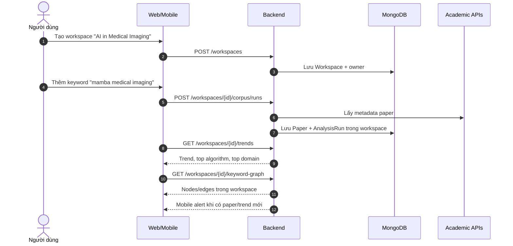

# Research Workspace / Place

Tài liệu này mô tả hướng phát triển **Research Workspace**: không gian nghiên cứu riêng cho cá nhân hoặc nhóm, nơi người dùng lưu paper, tạo corpus, ghi chú, theo dõi keyword và sinh ra trend nội bộ.

---

## 1. Ý tưởng cốt lõi

Dự án không chỉ trả lời câu hỏi “thế giới đang nghiên cứu gì?”, mà còn trả lời:

> Nhóm/cá nhân của tôi đang nghiên cứu gì, đang thiếu hướng nào, và nên theo dõi chủ đề nào tiếp theo?

Vì vậy hệ thống có 2 lớp trend:

| Lớp trend | Dữ liệu | Câu hỏi trả lời |
|---|---|---|
| **Global trend** | OpenAlex, Semantic Scholar, Crossref, IEEE, Exa | Thế giới đang nghiên cứu gì? |
| **Workspace trend** | Paper, corpus, note và keyword trong workspace | Nhóm tôi đang nghiên cứu gì, thiếu gì, nên đi hướng nào tiếp? |

---

## 2. Giá trị nghiệp vụ

Research Workspace biến hệ thống từ công cụ tìm kiếm paper thành một nơi làm việc nghiên cứu.

| Giá trị | Ý nghĩa |
|---|---|
| Lưu ngữ cảnh nghiên cứu | Paper, keyword, note và corpus nằm chung một không gian |
| Tạo trend riêng | Trend được tính trên bộ paper mà cá nhân/nhóm đang quan tâm |
| Làm việc nhóm | Giảng viên, sinh viên hoặc lab dùng chung thư viện paper |
| Theo dõi liên tục | Mobile gửi alert khi có paper mới hoặc keyword tăng |
| Tăng giá trị trả phí | Workspace nhóm, AI summary, export report và quota corpus là tính năng có thể tính phí |

Câu pitch ngắn:

> Hệ thống không chỉ giúp người dùng biết thế giới đang nghiên cứu gì, mà còn tạo một workspace nghiên cứu riêng để cá nhân hoặc nhóm theo dõi paper, xây dựng corpus, phân tích xu hướng nội bộ và nhận gợi ý hướng nghiên cứu tiếp theo.

---

## 3. Use case chính

| Use case | Actor | Ý nghĩa |
|---|---|---|
| Tạo workspace | User đăng nhập | Tạo không gian nghiên cứu cá nhân hoặc nhóm |
| Mời thành viên | Owner | Cho giảng viên/sinh viên/researcher cùng tham gia |
| Thêm paper vào workspace | Owner / Editor | Gom paper quan trọng vào một thư viện riêng |
| Tạo corpus trong workspace | Owner / Editor | Chạy phân tích corpus theo keyword trong ngữ cảnh workspace |
| Xem trend riêng | Member | Xem keyword, algorithm, domain nổi trong workspace |
| Ghi note/ý tưởng | Owner / Editor | Lưu nhận xét, hướng nghiên cứu, vấn đề còn mở |
| Follow keyword | Member | Nhận alert khi có paper mới hoặc trend tăng |
| Export report | Pro / Team | Xuất báo cáo cho proposal, seminar, thesis |

---

## 4. Web và Mobile

| Kênh | Vai trò chính | Tính năng phù hợp |
|---|---|---|
| Web | Phân tích sâu | Dashboard, graph, algorithm-domain insight, quản lý member, export report |
| Mobile | Theo dõi hằng ngày | Bookmark nhanh, đọc summary, thêm note nhanh, nhận alert paper/trend |

Mobile không nên chỉ là bản thu nhỏ của web. Mobile nên là **research radar cá nhân**: mở app nhanh để xem paper mới, alert mới, note nhanh và summary ngắn.

---

## 5. Thiết kế backend tương lai

Backend v1 đã triển khai lớp Workspace quanh các model có sẵn: `User`, `Paper`, `AnalysisRun`, `Keyword`, `Topic`. Phần thanh toán/quota vẫn là định hướng sản phẩm, chưa khóa feature theo gói.

### 5.1 Model dự kiến

| Model | Vai trò |
|---|---|
| `Workspace` | Thông tin workspace: tên, mô tả, owner, visibility, plan |
| `WorkspaceMember` | Thành viên và quyền trong workspace |
| `WorkspacePaper` | Paper được thêm vào workspace, kèm tags/note |
| `WorkspaceCorpus` | Liên kết workspace với `AnalysisRun` |
| `WorkspaceNote` | Ghi chú nghiên cứu, có thể gắn với paper |
| `WorkspaceAlert` | Cấu hình alert keyword/trend/paper mới |

### 5.2 Quyền truy cập

| Role | Quyền |
|---|---|
| `owner` | Quản lý workspace, member, xóa dữ liệu |
| `editor` | Thêm paper, tạo corpus, viết note |
| `viewer` | Xem dashboard, paper, note |

### 5.3 API dự kiến

| API | Mục đích |
|---|---|
| `POST /workspaces` | Tạo workspace |
| `GET /workspaces` | Danh sách workspace của user |
| `GET /workspaces/{id}` | Chi tiết workspace |
| `POST /workspaces/{id}/members` | Mời/thêm thành viên |
| `POST /workspaces/{id}/papers` | Thêm paper vào workspace |
| `GET /workspaces/{id}/papers` | Xem paper trong workspace |
| `POST /workspaces/{id}/papers/{paperId}/pdf` | Upload PDF cho paper trong workspace |
| `POST /workspaces/{id}/corpus/runs` | Tạo corpus run trong workspace |
| `GET /workspaces/{id}/trends` | Trend riêng của workspace |
| `GET /workspaces/{id}/keyword-graph` | Graph keyword trong workspace |
| `POST /workspaces/{id}/notes` | Thêm note nghiên cứu |
| `GET /workspaces/{id}/notes` | Xem note trong workspace |
| `POST /workspaces/{id}/alerts` | Tạo alert keyword/trend |
| `GET /workspaces/{id}/alerts` | Xem alert trong workspace |

---

## 6. Monetization

Workspace là nền tảng hợp lý để tính phí vì nó tạo thói quen sử dụng lặp lại.

| Gói | Giới hạn / Giá trị |
|---|---|
| `Free` | 1 workspace cá nhân, giới hạn paper/corpus, trend cơ bản |
| `Pro` | Nhiều workspace hơn, nhiều corpus hơn, AI summary, export PDF/CSV, graph nâng cao |
| `Team/Lab` | Workspace nhóm, phân quyền thành viên, shared library, alert theo domain/keyword, dashboard nhóm |

Các tính năng có thể khóa theo gói:

| Feature | Free | Pro | Team/Lab |
|---|---:|---:|---:|
| Workspace cá nhân | Có | Có | Có |
| Workspace nhóm | Không | Giới hạn | Có |
| Corpus trong workspace | Ít lượt/tháng | Nhiều hơn | Theo gói nhóm |
| AI summary | Ít lượt/ngày | Nhiều lượt | Theo quota nhóm |
| Keyword graph nâng cao | Không | Có | Có |
| Export report | Không | Có | Có |
| Mobile alert cá nhân hóa | Cơ bản | Có | Có |

---

## 7. Luồng ví dụ

---

## 8. Quan hệ với hệ thống hiện tại

Workspace không thay thế corpus hiện tại. Workspace chỉ thêm một lớp ngữ cảnh:

| Hiện tại | Khi có Workspace |
|---|---|
| `Paper` lưu metadata học thuật | `WorkspacePaper` gắn paper vào workspace cụ thể |
| `AnalysisRun` là một corpus snapshot | `WorkspaceCorpus` liên kết run với workspace |
| `/trends/*` trả insight global/local theo DB | `/workspaces/{id}/trends` trả insight trong workspace |
| User bookmark paper cá nhân | User/nhóm có shared library trong workspace |

Điểm quan trọng: backend có thể tái sử dụng pipeline ingest/analyze hiện tại, chỉ cần thêm `workspaceId` ở lớp API/service khi triển khai sau này.
