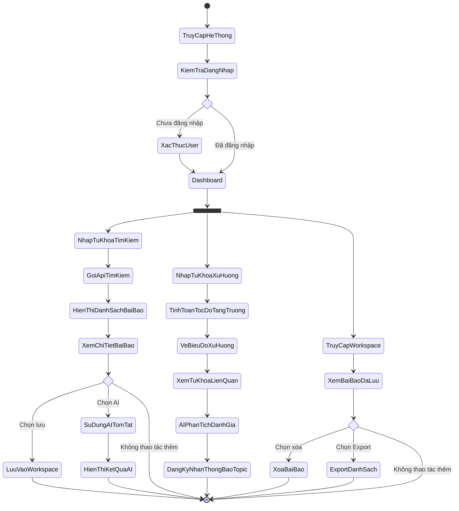

# Biểu đồ Hoạt động (Activity Diagram)

Biểu đồ Hoạt động (Activity Diagram) dưới đây mô tả luồng kiểm soát hành vi của người dùng từ khi bắt đầu truy cập hệ thống cho đến khi hoàn thành các tác vụ cốt lõi như tìm kiếm bài báo, phân tích xu hướng hoặc quản lý thư viện.

