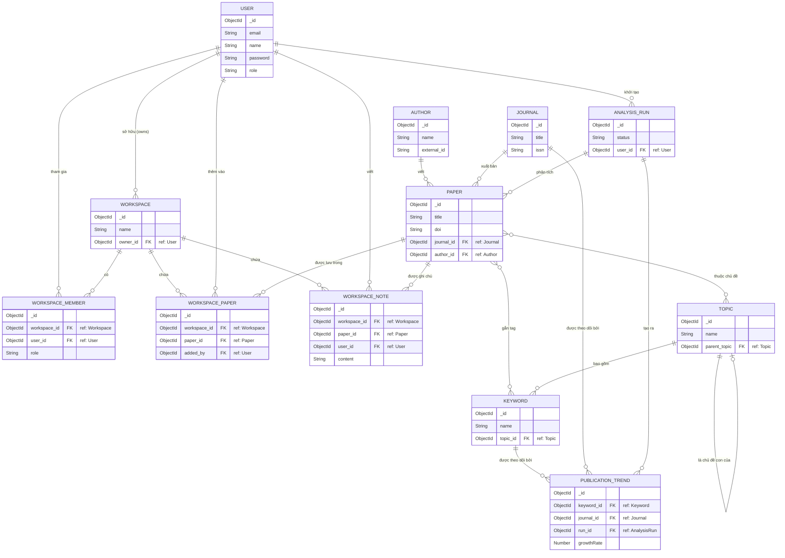

```mermaid
erDiagram
    %% KHỐI NGƯỜI DÙNG & WORKSPACE
    USER {
        ObjectId _id
        String email
        String name
        String password
        String role
    }
    
    WORKSPACE {
        ObjectId _id
        String name
        ObjectId owner_id FK "ref: User"
    }

    WORKSPACE_MEMBER {
        ObjectId _id
        ObjectId workspace_id FK "ref: Workspace"
        ObjectId user_id FK "ref: User"
        String role
    }

    WORKSPACE_PAPER {
        ObjectId _id
        ObjectId workspace_id FK "ref: Workspace"
        ObjectId paper_id FK "ref: Paper"
        ObjectId added_by FK "ref: User"
    }

    WORKSPACE_NOTE {
        ObjectId _id
        ObjectId workspace_id FK "ref: Workspace"
        ObjectId paper_id FK "ref: Paper"
        ObjectId user_id FK "ref: User"
        String content
    }

    %% KHỐI HỌC THUẬT (BÀI BÁO, TÁC GIẢ, TẠP CHÍ)
    PAPER {
        ObjectId _id
        String title
        String doi
        ObjectId journal_id FK "ref: Journal"
        ObjectId author_id FK "ref: Author"
    }

    AUTHOR {
        ObjectId _id
        String name
        String external_id
    }

    JOURNAL {
        ObjectId _id
        String title
        String issn
    }

    %% KHỐI PHÂN TÍCH & XU HƯỚNG
    TOPIC {
        ObjectId _id
        String name
        ObjectId parent_topic FK "ref: Topic"
    }

    KEYWORD {
        ObjectId _id
        String name
        ObjectId topic_id FK "ref: Topic"
    }

    PUBLICATION_TREND {
        ObjectId _id
        ObjectId keyword_id FK "ref: Keyword"
        ObjectId journal_id FK "ref: Journal"
        ObjectId run_id FK "ref: AnalysisRun"
        Number growthRate
    }

    ANALYSIS_RUN {
        ObjectId _id
        String status
        ObjectId user_id FK "ref: User"
    }

    %% QUAN HỆ (RELATIONSHIPS)
    
    %% User & Workspace
    USER ||--o{ WORKSPACE : "sở hữu (owns)"
    USER ||--o{ WORKSPACE_MEMBER : "tham gia"
    WORKSPACE ||--o{ WORKSPACE_MEMBER : "có"
    
    %% Workspace & Các thành phần con
    WORKSPACE ||--o{ WORKSPACE_PAPER : "chứa"
    WORKSPACE ||--o{ WORKSPACE_NOTE : "chứa"
    USER ||--o{ WORKSPACE_PAPER : "thêm vào"
    USER ||--o{ WORKSPACE_NOTE : "viết"
    PAPER ||--o{ WORKSPACE_PAPER : "được lưu trong"
    PAPER ||--o{ WORKSPACE_NOTE : "được ghi chú"
    
    %% Paper & Học thuật
    AUTHOR ||--o{ PAPER : "viết"
    JOURNAL ||--o{ PAPER : "xuất bản"
    PAPER }o--o{ KEYWORD : "gắn tag"
    PAPER }o--o{ TOPIC : "thuộc chủ đề"
    
    %% Phân tích xu hướng
    TOPIC ||--o{ KEYWORD : "bao gồm"
    TOPIC ||--o| TOPIC : "là chủ đề con của"
    KEYWORD ||--o{ PUBLICATION_TREND : "được theo dõi bởi"
    JOURNAL ||--o{ PUBLICATION_TREND : "được theo dõi bởi"
    
    %% Tiến trình phân tích (Analysis Run)
    USER ||--o{ ANALYSIS_RUN : "khởi tạo"
    ANALYSIS_RUN ||--o{ PUBLICATION_TREND : "tạo ra"
    ANALYSIS_RUN ||--o{ PAPER : "phân tích"
```
