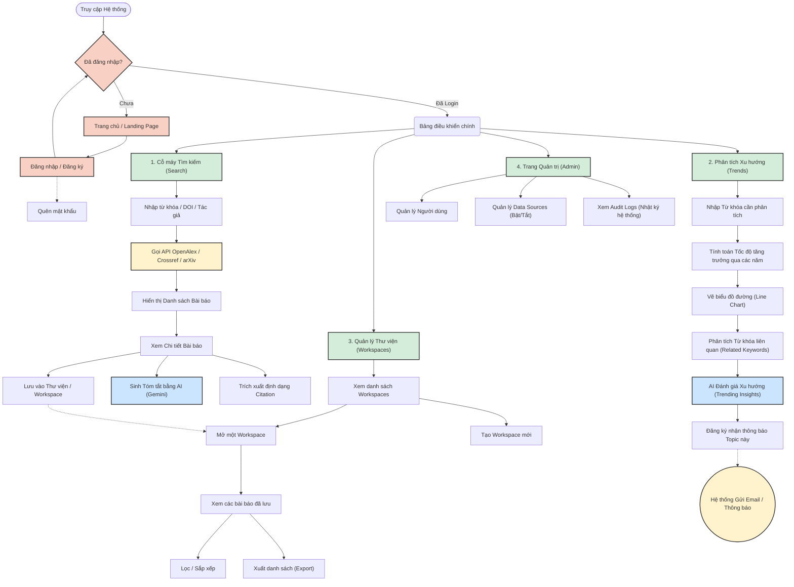

# Biểu đồ Luồng Chức năng Hệ thống (System Flowchart)

Dưới đây là biểu đồ **Flowchart** thể hiện hành trình của người dùng và sự liên kết giữa các chức năng cốt lõi trong hệ thống (từ khi truy cập đến khi sử dụng các tính năng phân tích chuyên sâu).

### Giải thích các Nhóm Chức năng Chính:

1. **Nhóm Xác thực (Màu Đỏ Nhạt):** Người dùng chưa đăng nhập sẽ đi qua Landing Page, thực hiện Đăng nhập hoặc Đăng ký.
2. **Nhóm Tính năng Lõi (Màu Xanh Lá):** Từ Bảng điều khiển, người dùng có thể rẽ nhánh vào 4 module chính của hệ thống.
3. **Nhóm AI (Màu Xanh Dương):** Bất cứ khi nào người dùng xem chi tiết bài báo hoặc xem xu hướng từ khóa, họ có thể sử dụng sức mạnh của AI (Gemini) để sinh tóm tắt hoặc nhận xét về độ hot của xu hướng.
4. **Nhóm Tương tác Ngoại cảnh (Màu Vàng):** Bao gồm việc hệ thống Fetch dữ liệu từ OpenAlex/Crossref hoặc các Background Job chạy ngầm để gửi Email thông báo (Notification) khi có bài báo mới thuộc Topic đã đăng ký.
