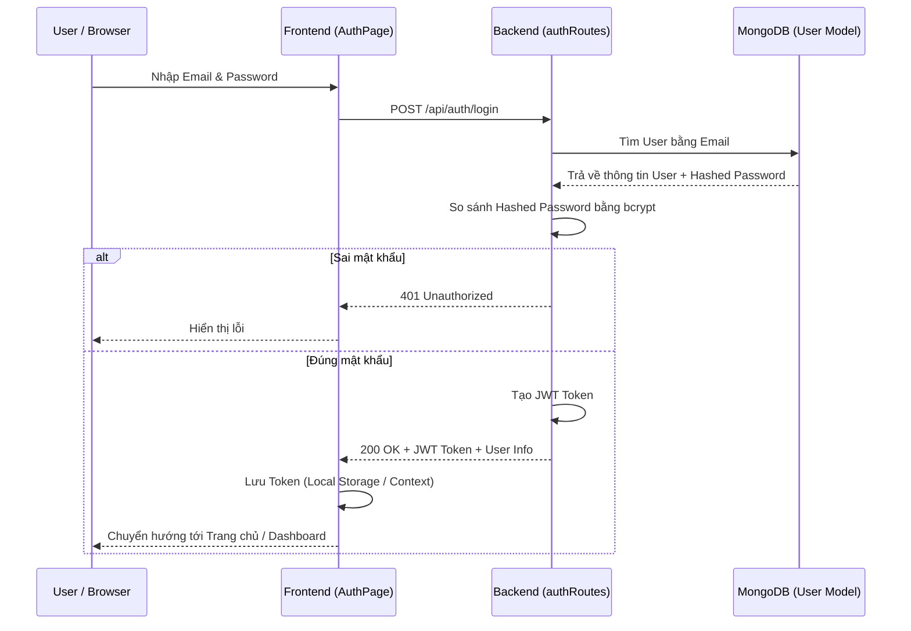
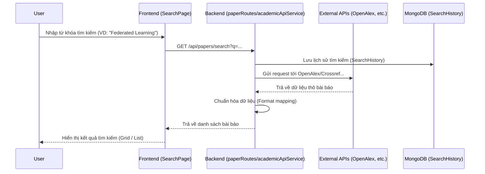
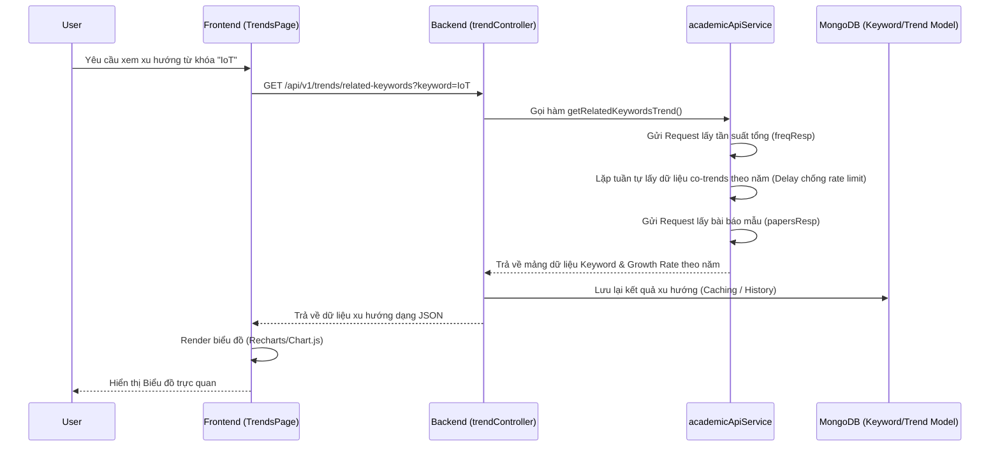
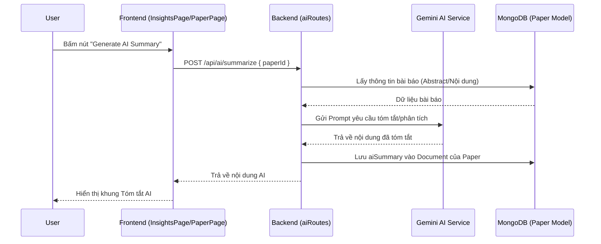
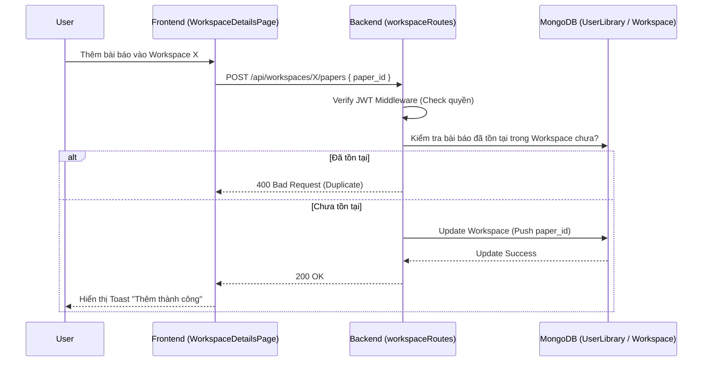

# Sơ đồ Luồng Hoạt động Hệ thống (System Flows)

Dựa trên cấu trúc Frontend (Vite/React) và Backend (Node.js/Express) cùng tài liệu đặc tả, dưới đây là các luồng chạy chính của hệ thống.

## 1. Luồng Xác thực người dùng (Authentication Flow)
Quá trình đăng nhập, đăng ký và lấy token để truy cập các tài nguyên bảo mật.

## 2. Luồng Tìm kiếm và Truy xuất Bài báo (Paper Search Flow)
Cho phép người dùng tìm kiếm bài báo khoa học từ các nguồn bên ngoài (OpenAlex, Crossref, arXiv) thông qua Backend.

## 3. Luồng Phân tích Xu hướng Từ khóa (Keyword & Trend Analysis Flow)
Đây là tính năng cốt lõi của hệ thống, bao gồm truy xuất và tính toán tốc độ tăng trưởng của các từ khóa học thuật.

## 4. Luồng Tạo tóm tắt AI cho Bài báo (AI Insights / Summary Flow)
Sử dụng AI Service (như Gemini) để phân tích chuyên sâu nội dung hoặc tạo tóm tắt thông minh cho bài báo.

## 5. Luồng Quản lý Không gian làm việc / Thư viện (Workspace / Library Flow)
Người dùng lưu bài báo hoặc quản lý theo các nhóm riêng biệt.

