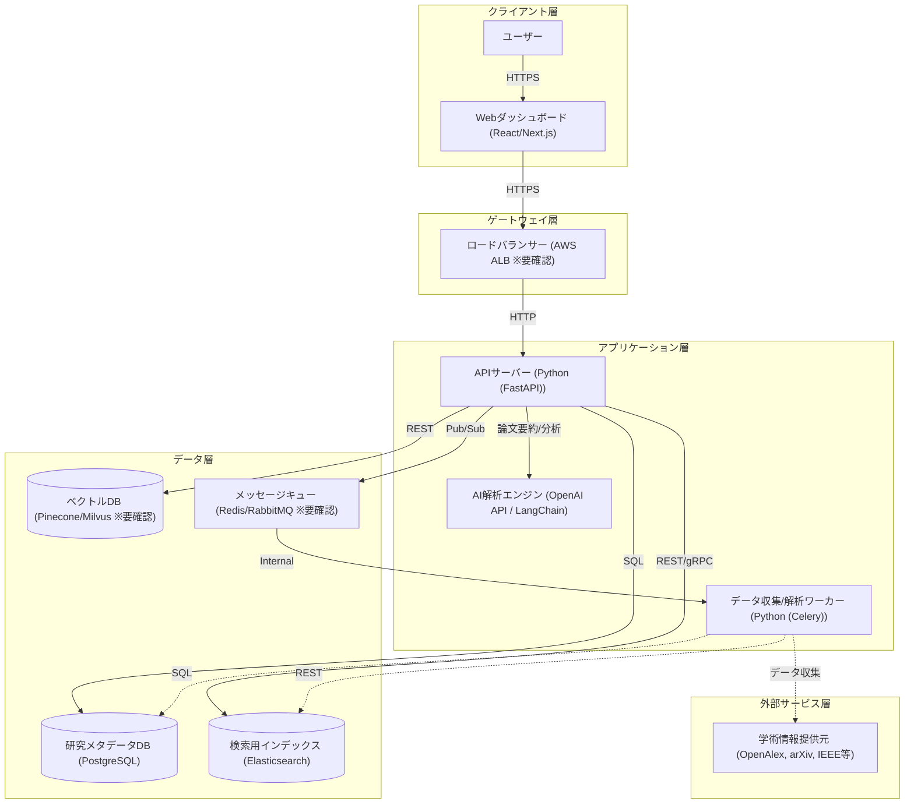

# アーキテクチャ構成図

外部学術APIと連携し、AIを活用した研究トレンド分析と可視化を提供するシステム

**クライアント層:**
- ユーザー
- Webダッシュボード [React/Next.js]

**ゲートウェイ層:**
- ロードバランサー [AWS ALB ※要確認]

**アプリケーション層:**
- APIサーバー [Python (FastAPI)]
- データ収集/解析ワーカー [Python (Celery)]
- AI解析エンジン [OpenAI API / LangChain]

**データ層:**
- 研究メタデータDB [PostgreSQL]
- 検索用インデックス [Elasticsearch]
- ベクトルDB [Pinecone/Milvus ※要確認]
- メッセージキュー [Redis/RabbitMQ ※要確認]

**外部サービス層:**
- 学術情報提供元 [OpenAlex, arXiv, IEEE等]

**接続:**
- ユーザー → Webダッシュボード (HTTPS)
- Webダッシュボード → ロードバランサー (HTTPS)
- ロードバランサー → APIサーバー (HTTP)
- APIサーバー → 研究メタデータDB (SQL)
- APIサーバー → 検索用インデックス (REST/gRPC)
- APIサーバー → ベクトルDB (REST)
- APIサーバー → AI解析エンジン (HTTPS)
- APIサーバー → メッセージキュー (Pub/Sub)
- メッセージキュー → データ収集/解析ワーカー (Internal)
- データ収集/解析ワーカー → 学術情報提供元 (HTTPS)
- データ収集/解析ワーカー → 研究メタデータDB (SQL)
- データ収集/解析ワーカー → 検索用インデックス (REST)

