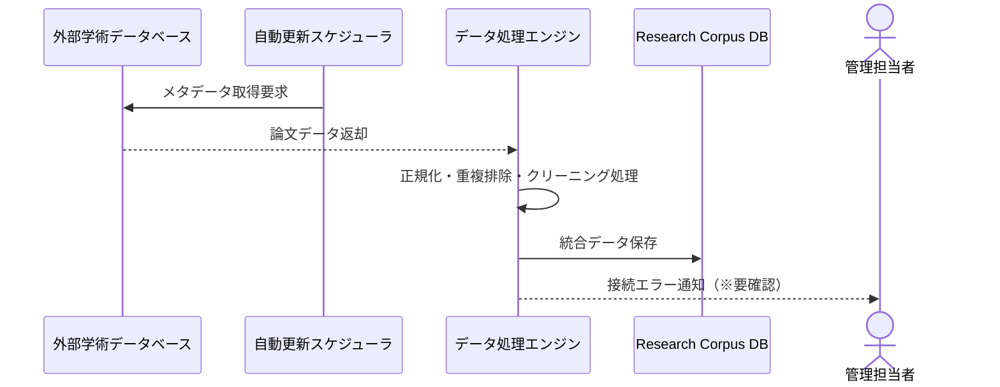
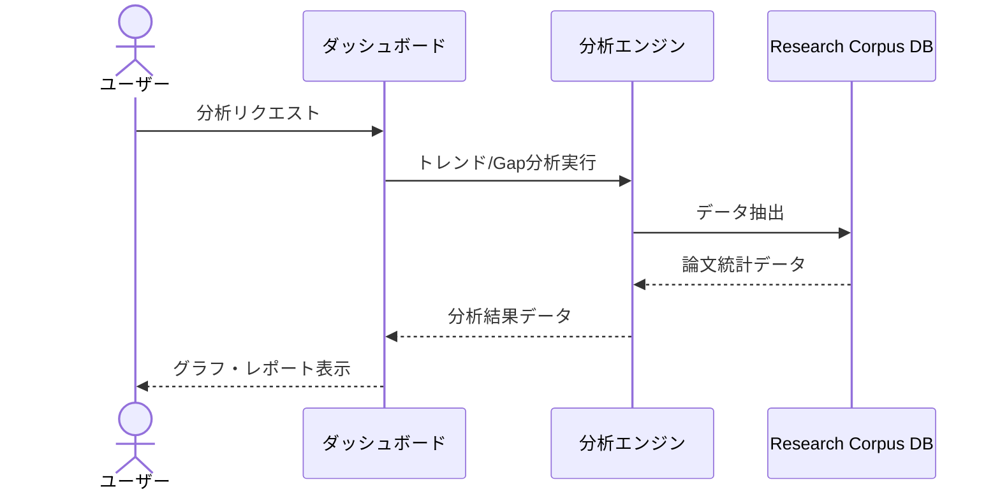
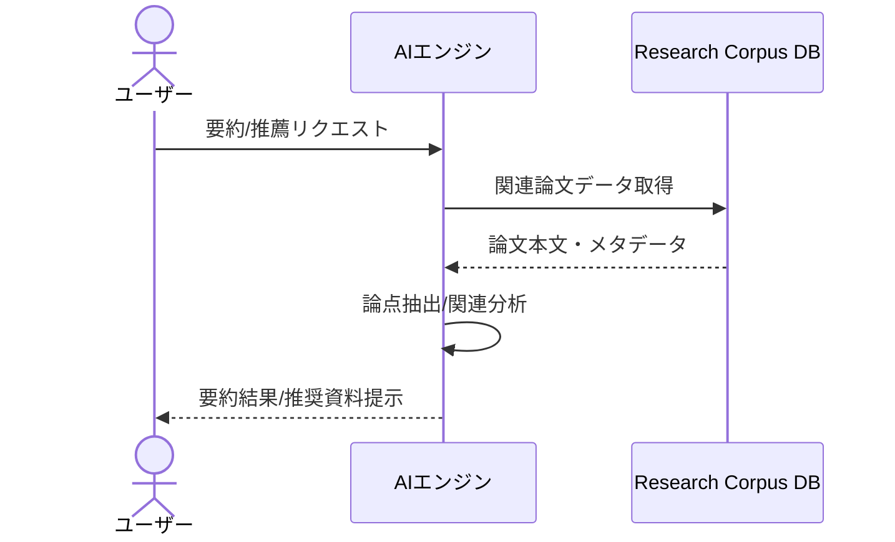

# 業務フロー

## データ収集・管理（Research Corpus）

外部学術ソースから論文メタデータを収集し、正規化してデータベースへ格納するまでの業務フロー

**参加者:** 外部学術データベース (external)、自動更新スケジューラ (system)、データ処理エンジン (system)、Research Corpus DB (database)、管理担当者 (actor)

**メッセージフロー:**
- 自動更新スケジューラ → 外部学術データベース: メタデータ取得要求
  - 外部学術データベース ← データ処理エンジン: 論文データ返却
- データ処理エンジン → データ処理エンジン: 正規化・重複排除・クリーニング処理
- データ処理エンジン → Research Corpus DB: 統合データ保存
- データ処理エンジン → 管理担当者: 接続エラー通知（※要確認）

## 分析エンジン・ダッシュボード

蓄積されたデータを分析し、トレンドやResearch Gapを可視化するまでの業務フロー

**参加者:** ユーザー (actor)、ダッシュボード (system)、分析エンジン (system)、Research Corpus DB (database)

**メッセージフロー:**
- ユーザー → ダッシュボード: 分析リクエスト
- ダッシュボード → 分析エンジン: トレンド/Gap分析実行
- 分析エンジン → Research Corpus DB: データ抽出
  - Research Corpus DB ← 分析エンジン: 論文統計データ
  - 分析エンジン ← ダッシュボード: 分析結果データ
  - ダッシュボード ← ユーザー: グラフ・レポート表示

## AI支援機能

論文の要約やレコメンデーションを提供するAI支援の業務フロー

**参加者:** ユーザー (actor)、AIエンジン (system)、Research Corpus DB (database)

**メッセージフロー:**
- ユーザー → AIエンジン: 要約/推薦リクエスト
- AIエンジン → Research Corpus DB: 関連論文データ取得
  - Research Corpus DB ← AIエンジン: 論文本文・メタデータ
- AIエンジン → AIエンジン: 論点抽出/関連分析
  - AIエンジン ← ユーザー: 要約結果/推奨資料提示

