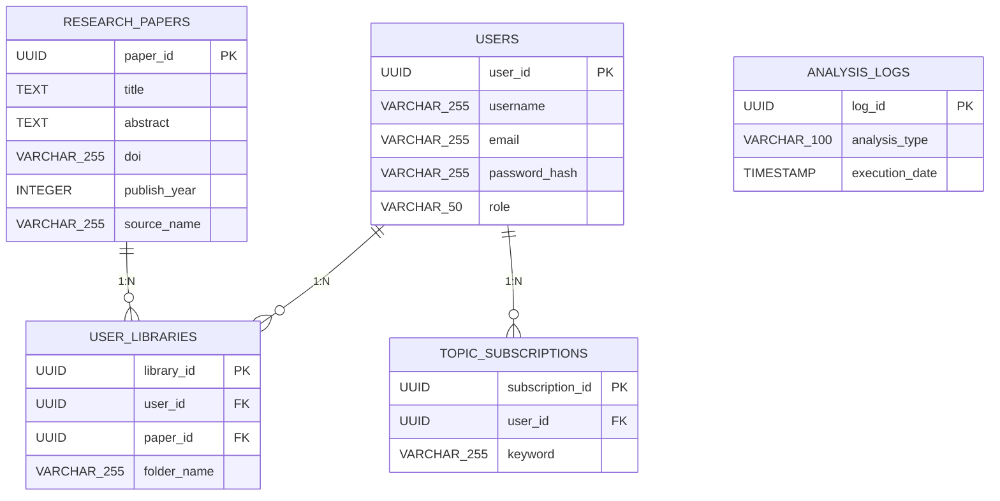

# ER図

科学研究トレンド追跡システムのER図。ユーザー、論文、ライブラリ、購読設定、分析ログ間の関係を定義。

### エンティティ一覧

**USERS**

| カラム名 | データ型 | キー |
| --- | --- | --- |
| user_id | UUID | PK |
| username | VARCHAR(255) |  |
| email | VARCHAR(255) |  |
| password_hash | VARCHAR(255) |  |
| role | VARCHAR(50) |  |

**RESEARCH_PAPERS**

| カラム名 | データ型 | キー |
| --- | --- | --- |
| paper_id | UUID | PK |
| title | TEXT |  |
| abstract | TEXT |  |
| doi | VARCHAR(255) |  |
| publish_year | INTEGER |  |
| source_name | VARCHAR(255) |  |

**USER_LIBRARIES**

| カラム名 | データ型 | キー |
| --- | --- | --- |
| library_id | UUID | PK |
| user_id | UUID | FK |
| paper_id | UUID | FK |
| folder_name | VARCHAR(255) |  |

**TOPIC_SUBSCRIPTIONS**

| カラム名 | データ型 | キー |
| --- | --- | --- |
| subscription_id | UUID | PK |
| user_id | UUID | FK |
| keyword | VARCHAR(255) |  |

**ANALYSIS_LOGS**

| カラム名 | データ型 | キー |
| --- | --- | --- |
| log_id | UUID | PK |
| analysis_type | VARCHAR(100) |  |
| execution_date | TIMESTAMP |  |

### リレーション

- USERS → USER_LIBRARIES (1:N)
- RESEARCH_PAPERS → USER_LIBRARIES (1:N)
- USERS → TOPIC_SUBSCRIPTIONS (1:N)

### ER図

