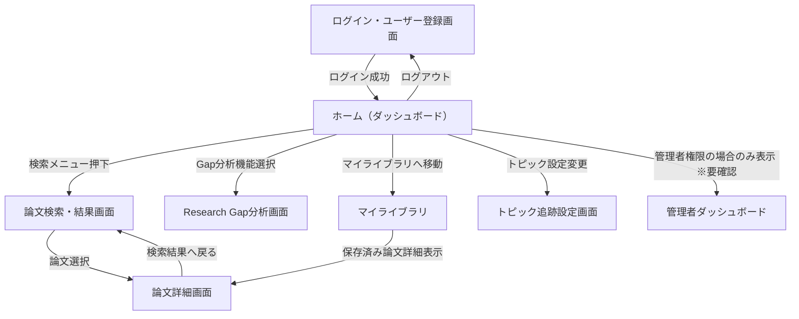

# 画面遷移

科学研究トレンド追跡システムの画面遷移図。認証後、ダッシュボードを起点として各分析機能やライブラリ、設定画面へアクセスする構成。※要確認：未定義の階層構造や詳細なメニュー遷移。

**フロー:**
- ログイン・ユーザー登録画面 → ホーム（ダッシュボード） (ログイン成功)
- ホーム（ダッシュボード） → 論文検索・結果画面 (検索メニュー押下)
- ホーム（ダッシュボード） → Research Gap分析画面 (Gap分析機能選択)
- ホーム（ダッシュボード） → マイライブラリ (マイライブラリへ移動)
- ホーム（ダッシュボード） → トピック追跡設定画面 (トピック設定変更)
- ホーム（ダッシュボード） → 管理者ダッシュボード (管理者権限の場合のみ表示 ※要確認)
- 論文検索・結果画面 → 論文詳細画面 (論文選択)
- 論文詳細画面 → 論文検索・結果画面 (検索結果へ戻る)
- マイライブラリ → 論文詳細画面 (保存済み論文詳細表示)
- ホーム（ダッシュボード） → ログイン・ユーザー登録画面 (ログアウト)

