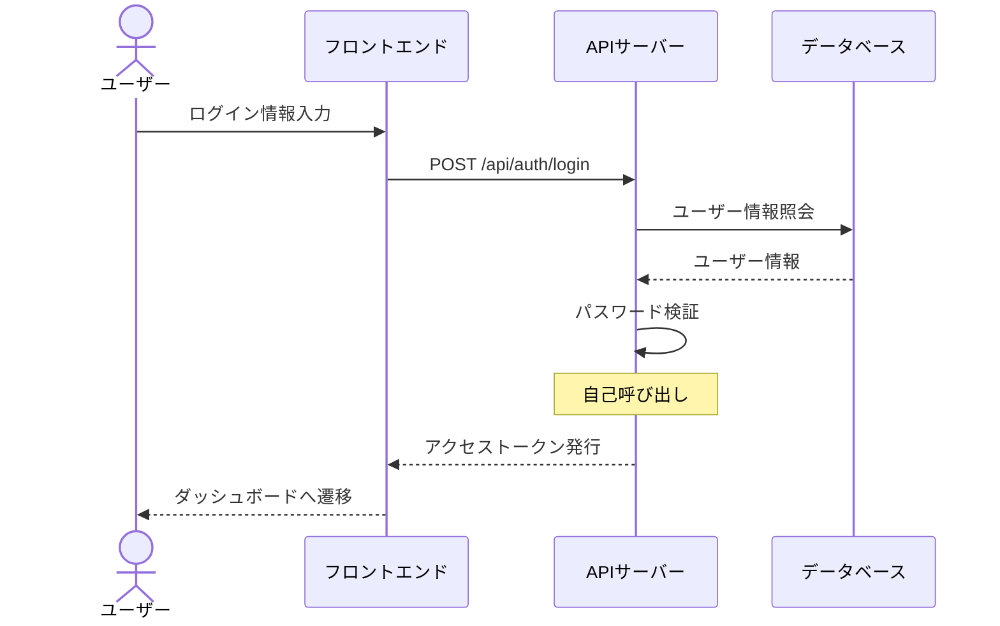
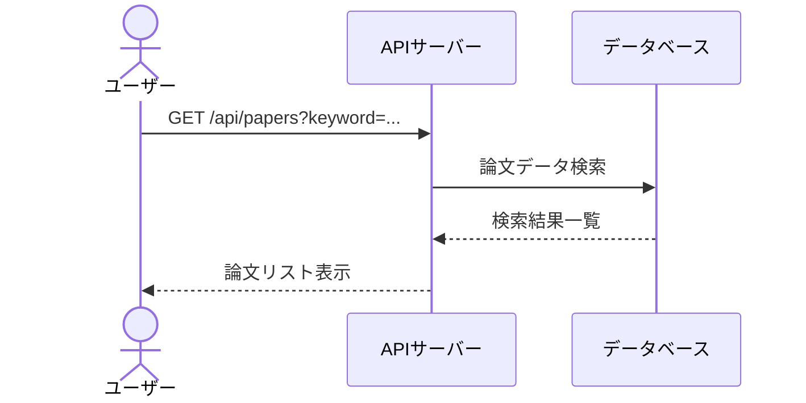
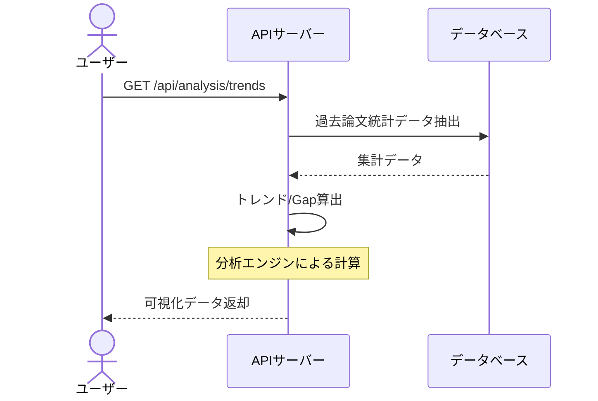
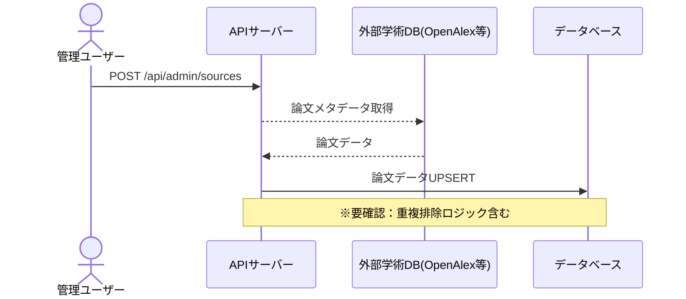

# シーケンス図

## ユーザー認証フロー

ユーザーがメールとパスワードを用いてログインし、トークンを取得する処理。

**参加者:** ユーザー (actor)、フロントエンド (system)、APIサーバー (system)、データベース (database)

**メッセージフロー:**
- ユーザー → フロントエンド: ログイン情報入力
- フロントエンド → APIサーバー: POST /api/auth/login
- APIサーバー → データベース: ユーザー情報照会
  - データベース ← APIサーバー: ユーザー情報
- APIサーバー → APIサーバー: パスワード検証
  - APIサーバー ← フロントエンド: アクセストークン発行
  - フロントエンド ← ユーザー: ダッシュボードへ遷移

## データ探索フロー

ユーザーがキーワードを用いて論文を検索する処理。

**参加者:** ユーザー (actor)、APIサーバー (system)、データベース (database)

**メッセージフロー:**
- ユーザー → APIサーバー: GET /api/papers?keyword=...
- APIサーバー → データベース: 論文データ検索
  - データベース ← APIサーバー: 検索結果一覧
  - APIサーバー ← ユーザー: 論文リスト表示

## 分析フロー

論文データを元にしたトレンド推移やGap分析の表示処理。

**参加者:** ユーザー (actor)、APIサーバー (system)、データベース (database)

**メッセージフロー:**
- ユーザー → APIサーバー: GET /api/analysis/trends
- APIサーバー → データベース: 過去論文統計データ抽出
  - データベース ← APIサーバー: 集計データ
- APIサーバー → APIサーバー: トレンド/Gap算出
  - APIサーバー ← ユーザー: 可視化データ返却

## データ更新フロー

外部学術ソースから最新の論文データを同期する処理。

**参加者:** 管理ユーザー (actor)、APIサーバー (system)、外部学術DB(OpenAlex等) (external)、データベース (database)

**メッセージフロー:**
- 管理ユーザー → APIサーバー: POST /api/admin/sources
- APIサーバー → 外部学術DB(OpenAlex等): 論文メタデータ取得
  - 外部学術DB(OpenAlex等) ← APIサーバー: 論文データ
- APIサーバー → データベース: 論文データUPSERT

