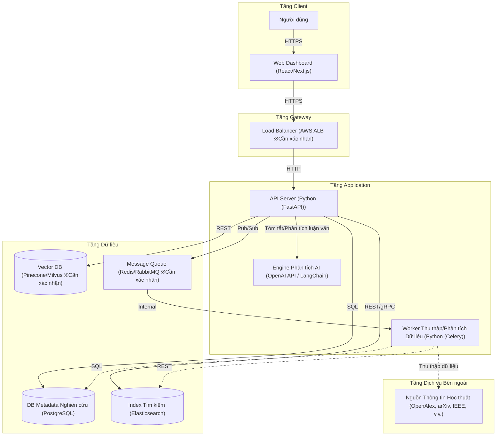

# Sơ đồ Kiến trúc

Hệ thống tích hợp với API học thuật bên ngoài, cung cấp phân tích xu hướng nghiên cứu và trực quan hóa có hỗ trợ AI.

**Tầng Client:**
- Người dùng
- Web Dashboard [React/Next.js]

**Tầng Gateway:**
- Load Balancer [AWS ALB ※Cần xác nhận]

**Tầng Application:**
- API Server [Python (FastAPI)]
- Worker Thu thập/Phân tích Dữ liệu [Python (Celery)]
- Engine Phân tích AI [OpenAI API / LangChain]

**Tầng Dữ liệu:**
- DB Metadata Nghiên cứu [PostgreSQL]
- Index Tìm kiếm [Elasticsearch]
- Vector DB [Pinecone/Milvus ※Cần xác nhận]
- Message Queue [Redis/RabbitMQ ※Cần xác nhận]

**Tầng Dịch vụ Bên ngoài:**
- Nguồn Thông tin Học thuật [OpenAlex, arXiv, IEEE, v.v.]

**Kết nối:**
- Người dùng → Web Dashboard (HTTPS)
- Web Dashboard → Load Balancer (HTTPS)
- Load Balancer → API Server (HTTP)
- API Server → DB Metadata Nghiên cứu (SQL)
- API Server → Index Tìm kiếm (REST/gRPC)
- API Server → Vector DB (REST)
- API Server → Engine Phân tích AI (HTTPS)
- API Server → Message Queue (Pub/Sub)
- Message Queue → Worker Thu thập/Phân tích Dữ liệu (Internal)
- Worker Thu thập/Phân tích Dữ liệu → Nguồn Thông tin Học thuật (HTTPS)
- Worker Thu thập/Phân tích Dữ liệu → DB Metadata Nghiên cứu (SQL)
- Worker Thu thập/Phân tích Dữ liệu → Index Tìm kiếm (REST)

