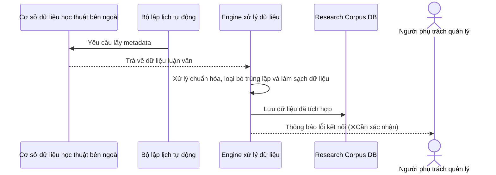
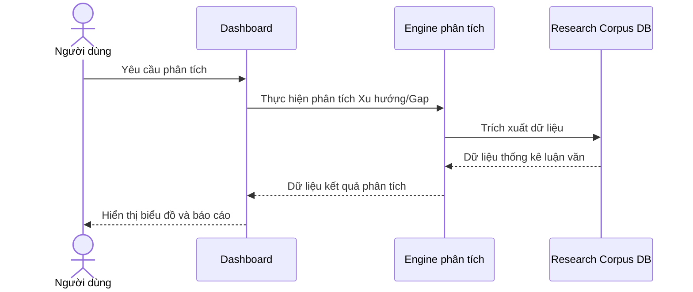
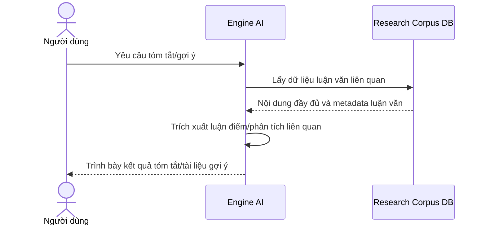

# Luồng Nghiệp vụ

## Thu thập & Quản lý Dữ liệu (Research Corpus)

Luồng nghiệp vụ từ việc thu thập metadata luận văn từ nguồn học thuật bên ngoài, chuẩn hóa đến lưu trữ vào cơ sở dữ liệu.

**Tham gia viên:** Cơ sở dữ liệu học thuật bên ngoài (external), Bộ lập lịch tự động (system), Engine xử lý dữ liệu (system), Research Corpus DB (database), Người phụ trách quản lý (actor)

**Luồng thông điệp:**
- Bộ lập lịch tự động → Cơ sở dữ liệu học thuật bên ngoài: Yêu cầu lấy metadata
  - Cơ sở dữ liệu học thuật bên ngoài ← Engine xử lý dữ liệu: Trả về dữ liệu luận văn
- Engine xử lý dữ liệu → Engine xử lý dữ liệu: Xử lý chuẩn hóa, loại bỏ trùng lặp và làm sạch dữ liệu
- Engine xử lý dữ liệu → Research Corpus DB: Lưu dữ liệu đã tích hợp
- Engine xử lý dữ liệu → Người phụ trách quản lý: Thông báo lỗi kết nối (※Cần xác nhận)

## Engine Phân tích & Dashboard

Luồng nghiệp vụ phân tích dữ liệu tích lũy và trực quan hóa xu hướng cũng như Research Gap.

**Tham gia viên:** Người dùng (actor), Dashboard (system), Engine phân tích (system), Research Corpus DB (database)

**Luồng thông điệp:**
- Người dùng → Dashboard: Yêu cầu phân tích
- Dashboard → Engine phân tích: Thực hiện phân tích Xu hướng/Gap
- Engine phân tích → Research Corpus DB: Trích xuất dữ liệu
  - Research Corpus DB ← Engine phân tích: Dữ liệu thống kê luận văn
  - Engine phân tích ← Dashboard: Dữ liệu kết quả phân tích
  - Dashboard ← Người dùng: Hiển thị biểu đồ và báo cáo

## Tính năng Hỗ trợ AI

Luồng nghiệp vụ hỗ trợ AI cung cấp tóm tắt luận văn và gợi ý.

**Tham gia viên:** Người dùng (actor), Engine AI (system), Research Corpus DB (database)

**Luồng thông điệp:**
- Người dùng → Engine AI: Yêu cầu tóm tắt/gợi ý
- Engine AI → Research Corpus DB: Lấy dữ liệu luận văn liên quan
  - Research Corpus DB ← Engine AI: Nội dung đầy đủ và metadata luận văn
- Engine AI → Engine AI: Trích xuất luận điểm/phân tích liên quan
  - Engine AI ← Người dùng: Trình bày kết quả tóm tắt/tài liệu gợi ý

