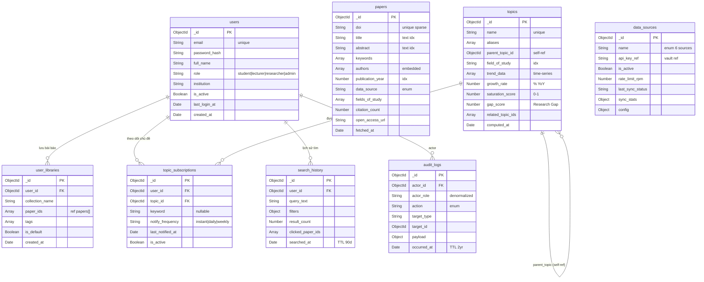

# Sơ đồ ER — MongoDB Collections

> **Database:** MongoDB | **Cập nhật theo schema thực tế**
> Ghi chú: MongoDB không có foreign key cứng — các mối quan hệ thể hiện qua ObjectId reference.

---

## 📋 Danh sách Collections (8 collections)

### 🔵 Core — `users`
> Tài khoản hệ thống: sinh viên, giảng viên, nhà nghiên cứu, admin

| Field | Kiểu | Ghi chú |
|---|---|---|
| `_id` | ObjectId | PK |
| `email` | String | unique |
| `password_hash` | String | |
| `full_name` | String | |
| `role` | Enum | `student` \| `lecturer` \| `researcher` \| `admin` |
| `institution` | String | |
| `avatar_url` | String | |
| `is_active` | Boolean | |
| `last_login_at` | Date | |
| `created_at` | Date | |
| `updated_at` | Date | |

---

### 🔵 Core — `papers`
> Research Corpus — metadata bài báo chuẩn hóa từ mọi nguồn

| Field | Kiểu | Ghi chú |
|---|---|---|
| `_id` | ObjectId | PK |
| `doi` | String | unique sparse |
| `external_ids` | Object | `{openalex_id, s2_id, arxiv_id, ieee_id, acm}` |
| `title` | String | text index |
| `abstract` | String | text index |
| `keywords` | String[] | array |
| `authors` | Object[] | `[{name, affiliation, orcid}]` — embedded |
| `publication_year` | Number | idx |
| `source_venue` | Object | `{name, type, issn}` |
| `data_source` | Enum | `openalex` \| `s2` \| `crossref` \| `arxiv` \| `ieee` \| `acm` |
| `fields_of_study` | String[] | array, controlled vocabulary |
| `citation_count` | Number | |
| `open_access_url` | String | |
| `fetched_at` | Date | |
| `updated_at` | Date | |

---

### 🟠 Analysis — `topics`
> Chủ đề/từ khóa nghiên cứu và dữ liệu xu hướng theo năm — **pre-computed cho FR-005, FR-006, FR-007**

| Field | Kiểu | Ghi chú |
|---|---|---|
| `_id` | ObjectId | PK |
| `name` | String | unique |
| `aliases` | String[] | tên thay thế, viết tắt |
| `parent_topic_id` | ObjectId | → `topics` (self-ref, phân cấp lĩnh vực) |
| `field_of_study` | String | idx |
| `trend_data` | Object[] | `[{year, paper_count, delta_pct}]` — time-series |
| `growth_rate` | Number | % YoY |
| `saturation_score` | Number | 0–1 (càng cao = càng bão hòa) |
| `gap_score` | Number | Research Gap score (cao = ít người khai thác) |
| `related_topic_ids` | ObjectId[] | → `topics[]` |
| `computed_at` | Date | lần cuối tính lại |

---

### 🟢 User — `user_libraries`
> Thư viện cá nhân: bộ sưu tập và bài báo đã lưu

| Field | Kiểu | Ghi chú |
|---|---|---|
| `_id` | ObjectId | PK |
| `user_id` | ObjectId | → `users` |
| `collection_name` | String | |
| `description` | String | |
| `paper_ids` | ObjectId[] | → `papers[]` — array references |
| `tags` | String[] | |
| `is_default` | Boolean | |
| `created_at` | Date | |
| `updated_at` | Date | |

> ⚠️ **Compound unique index:** `(user_id, collection_name)`
> `paper_ids` là array references — không embed paper (document lớn, share nhiều user)

---

### 🟢 User — `topic_subscriptions`
> Theo dõi từ khóa/lĩnh vực và nhận thông báo bài mới

| Field | Kiểu | Ghi chú |
|---|---|---|
| `_id` | ObjectId | PK |
| `user_id` | ObjectId | → `users` |
| `topic_id` | ObjectId | → `topics` (nullable) |
| `keyword` | String | nullable, free-form — một trong hai phải có |
| `notify_frequency` | Enum | `instant` \| `daily` \| `weekly` |
| `last_notified_at` | Date | |
| `is_active` | Boolean | |
| `created_at` | Date | |

> ⚠️ **Compound unique index:** `(user_id, topic_id)`

---

### 🔷 Activity — `search_history`
> Lịch sử tìm kiếm phục vụ gợi ý và cá nhân hóa

| Field | Kiểu | Ghi chú |
|---|---|---|
| `_id` | ObjectId | PK |
| `user_id` | ObjectId | → `users` |
| `query_text` | String | |
| `filters` | Object | `{year_range, authors, field, source}` |
| `result_count` | Number | |
| `clicked_paper_ids` | ObjectId[] | → `papers[]` |
| `searched_at` | Date | **TTL index 90 ngày** |

---

### 🔴 Admin — `data_sources`
> Cấu hình và trạng thái các cổng API nguồn dữ liệu

| Field | Kiểu | Ghi chú |
|---|---|---|
| `_id` | ObjectId | PK |
| `name` | Enum | `openalex` \| `s2` \| `crossref` \| `arxiv` \| `ieee` \| `acm` |
| `base_url` | String | |
| `api_key_ref` | String | vault ref — **không lưu raw key** |
| `is_active` | Boolean | |
| `rate_limit_rpm` | Number | |
| `last_sync_at` | Date | |
| `last_sync_status` | Enum | `success` \| `failed` \| `running` |
| `sync_stats` | Object | `{total_fetched, new_added, updated}` |
| `config` | Object | `{fields_filter, year_from}` |
| `updated_at` | Date | |

---

### 🔴 Admin — `audit_logs`
> Nhật ký hoạt động hệ thống và admin actions

| Field | Kiểu | Ghi chú |
|---|---|---|
| `_id` | ObjectId | PK |
| `actor_id` | ObjectId | → `users` |
| `actor_role` | String | denormalized snapshot tại thời điểm action |
| `action` | String | `PAPER_FETCH` \| `USER_BAN` \| `USER_PROMOTE` \| `SOURCE_TOGGLE` \| `LIBRARY_SAVE` \| `SUBSCRIPTION_ADD` \| `EXPORT_REPORT` |
| `target_type` | String | `paper` \| `user` \| `source` \| `library` |
| `target_id` | ObjectId | |
| `payload` | Object | `{before, after}` snapshot |
| `ip_address` | String | |
| `occurred_at` | Date | **TTL index 2 năm** |

> ⚠️ **Insert-only** collection — không update/delete

---

## 🔗 Quan hệ giữa các Collections

```
users (1) ──────────────────────────────────┐
  │                                          │
  ├──(1:N)──→ user_libraries                 │
  │             └── paper_ids[] ──→ papers   │
  │                                          │
  ├──(1:N)──→ topic_subscriptions            │
  │             └── topic_id ──→ topics      │
  │               (self-ref) parent_topic_id─┤
  │                                          │
  ├──(1:N)──→ search_history                 │
  │             └── clicked_paper_ids[] ──→ papers
  │                                          │
  └──(1:N)──→ audit_logs ←──────────────────┘
                (actor_id)

topics ──(related_topic_ids[])──→ topics (self-referencing)

data_sources ──(độc lập)── không ref collection khác
```

---

## 📊 Sơ đồ ER (Mermaid)



---

## ✅ Index Summary

| Collection | Index | Loại |
|---|---|---|
| `users` | `email` | unique |
| `papers` | `doi` | unique sparse |
| `papers` | `title, abstract` | text (full-text search) |
| `papers` | `publication_year` | single field |
| `papers` | `fields_of_study` | multikey array |
| `topics` | `name` | unique |
| `topics` | `field_of_study` | single field |
| `user_libraries` | `(user_id, collection_name)` | compound unique |
| `topic_subscriptions` | `(user_id, topic_id)` | compound unique |
| `search_history` | `searched_at` | TTL (90 ngày) |
| `audit_logs` | `occurred_at` | TTL (2 năm) |
