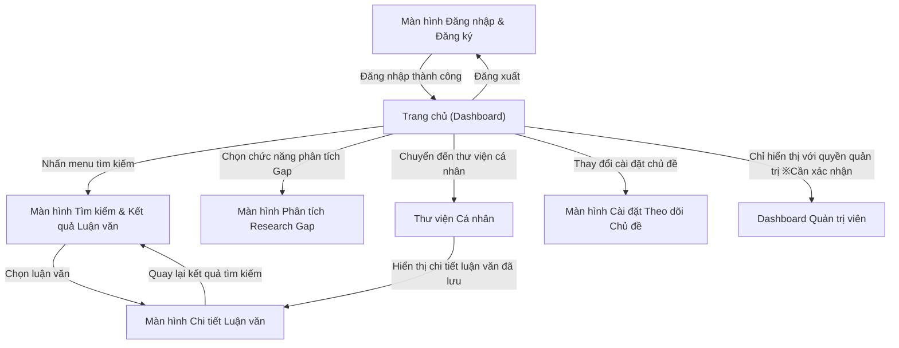

# Chuyển đổi Màn hình

Sơ đồ chuyển đổi màn hình của Hệ thống Theo dõi Xu hướng Nghiên cứu Khoa học. Cấu trúc truy cập đến các chức năng phân tích, thư viện và màn hình cài đặt từ dashboard sau khi xác thực. ※Cần xác nhận: Cấu trúc phân cấp và chuyển đổi menu chi tiết chưa được xác định.

**Luồng:**
- Màn hình Đăng nhập & Đăng ký → Trang chủ (Dashboard) (Đăng nhập thành công)
- Trang chủ (Dashboard) → Màn hình Tìm kiếm & Kết quả Luận văn (Nhấn menu tìm kiếm)
- Trang chủ (Dashboard) → Màn hình Phân tích Research Gap (Chọn chức năng phân tích Gap)
- Trang chủ (Dashboard) → Thư viện Cá nhân (Chuyển đến thư viện cá nhân)
- Trang chủ (Dashboard) → Màn hình Cài đặt Theo dõi Chủ đề (Thay đổi cài đặt chủ đề)
- Trang chủ (Dashboard) → Dashboard Quản trị viên (Chỉ hiển thị với quyền quản trị ※Cần xác nhận)
- Màn hình Tìm kiếm & Kết quả Luận văn → Màn hình Chi tiết Luận văn (Chọn luận văn)
- Màn hình Chi tiết Luận văn → Màn hình Tìm kiếm & Kết quả Luận văn (Quay lại kết quả tìm kiếm)
- Thư viện Cá nhân → Màn hình Chi tiết Luận văn (Hiển thị chi tiết luận văn đã lưu)
- Trang chủ (Dashboard) → Màn hình Đăng nhập & Đăng ký (Đăng xuất)

