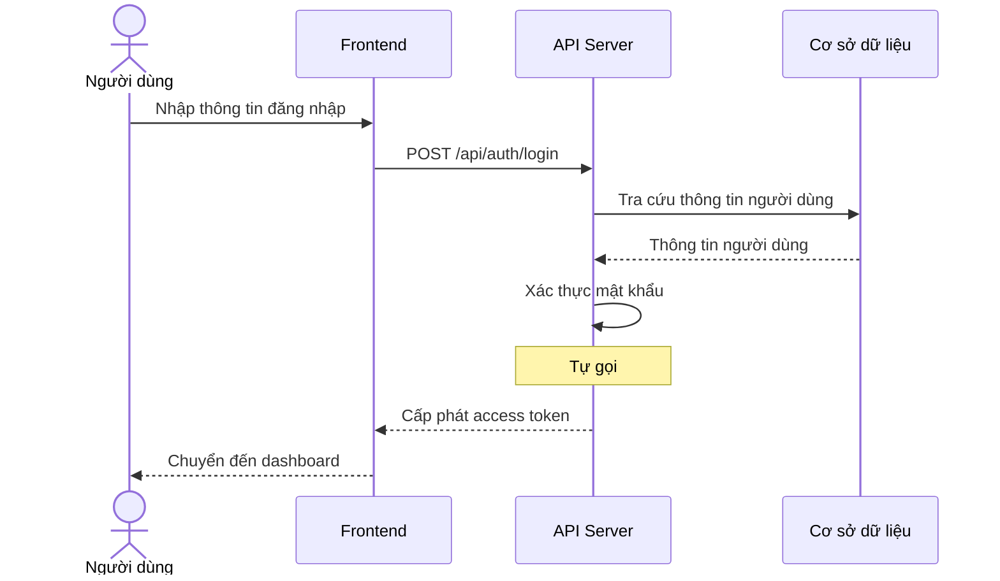
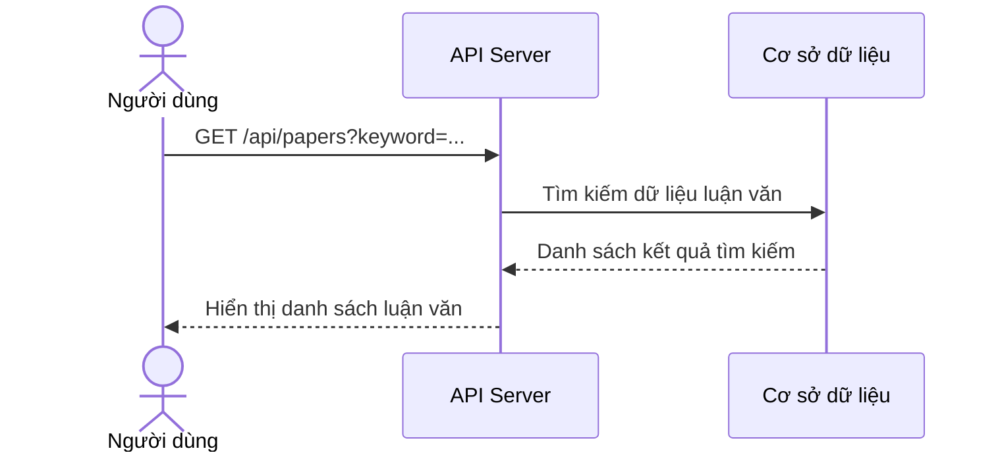
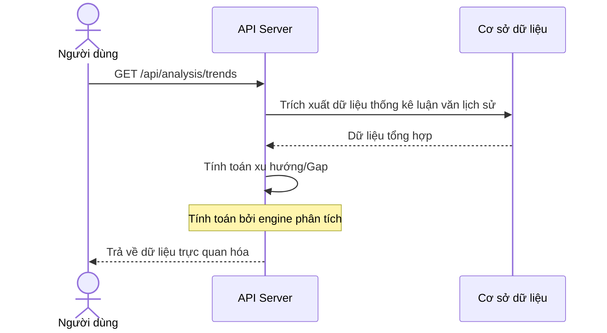
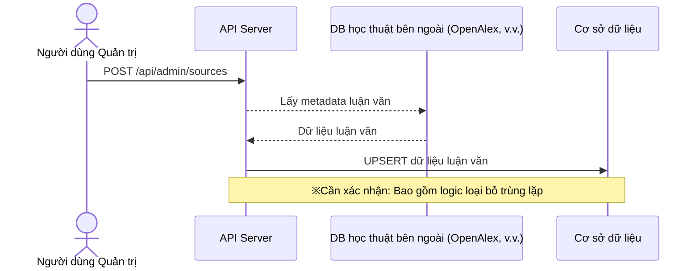

# Sơ đồ Trình tự

## Luồng Xác thực Người dùng

Quy trình người dùng đăng nhập bằng email và mật khẩu, sau đó lấy token.

**Tham gia viên:** Người dùng (actor), Frontend (system), API Server (system), Cơ sở dữ liệu (database)

**Luồng thông điệp:**
- Người dùng → Frontend: Nhập thông tin đăng nhập
- Frontend → API Server: POST /api/auth/login
- API Server → Cơ sở dữ liệu: Tra cứu thông tin người dùng
  - Cơ sở dữ liệu ← API Server: Thông tin người dùng
- API Server → API Server: Xác thực mật khẩu
  - API Server ← Frontend: Cấp phát access token
  - Frontend ← Người dùng: Chuyển đến dashboard

## Luồng Khám phá Dữ liệu

Quy trình người dùng tìm kiếm luận văn bằng từ khóa.

**Tham gia viên:** Người dùng (actor), API Server (system), Cơ sở dữ liệu (database)

**Luồng thông điệp:**
- Người dùng → API Server: GET /api/papers?keyword=...
- API Server → Cơ sở dữ liệu: Tìm kiếm dữ liệu luận văn
  - Cơ sở dữ liệu ← API Server: Danh sách kết quả tìm kiếm
  - API Server ← Người dùng: Hiển thị danh sách luận văn

## Luồng Phân tích

Quy trình hiển thị biến động xu hướng và phân tích Gap dựa trên dữ liệu luận văn.

**Tham gia viên:** Người dùng (actor), API Server (system), Cơ sở dữ liệu (database)

**Luồng thông điệp:**
- Người dùng → API Server: GET /api/analysis/trends
- API Server → Cơ sở dữ liệu: Trích xuất dữ liệu thống kê luận văn lịch sử
  - Cơ sở dữ liệu ← API Server: Dữ liệu tổng hợp
- API Server → API Server: Tính toán xu hướng/Gap
  - API Server ← Người dùng: Trả về dữ liệu trực quan hóa

## Luồng Cập nhật Dữ liệu

Quy trình đồng bộ dữ liệu luận văn mới nhất từ nguồn học thuật bên ngoài.

**Tham gia viên:** Người dùng Quản trị (actor), API Server (system), DB học thuật bên ngoài (OpenAlex, v.v.) (external), Cơ sở dữ liệu (database)

**Luồng thông điệp:**
- Người dùng Quản trị → API Server: POST /api/admin/sources
- API Server → DB học thuật bên ngoài (OpenAlex, v.v.): Lấy metadata luận văn
  - DB học thuật bên ngoài (OpenAlex, v.v.) ← API Server: Dữ liệu luận văn
- API Server → Cơ sở dữ liệu: UPSERT dữ liệu luận văn

